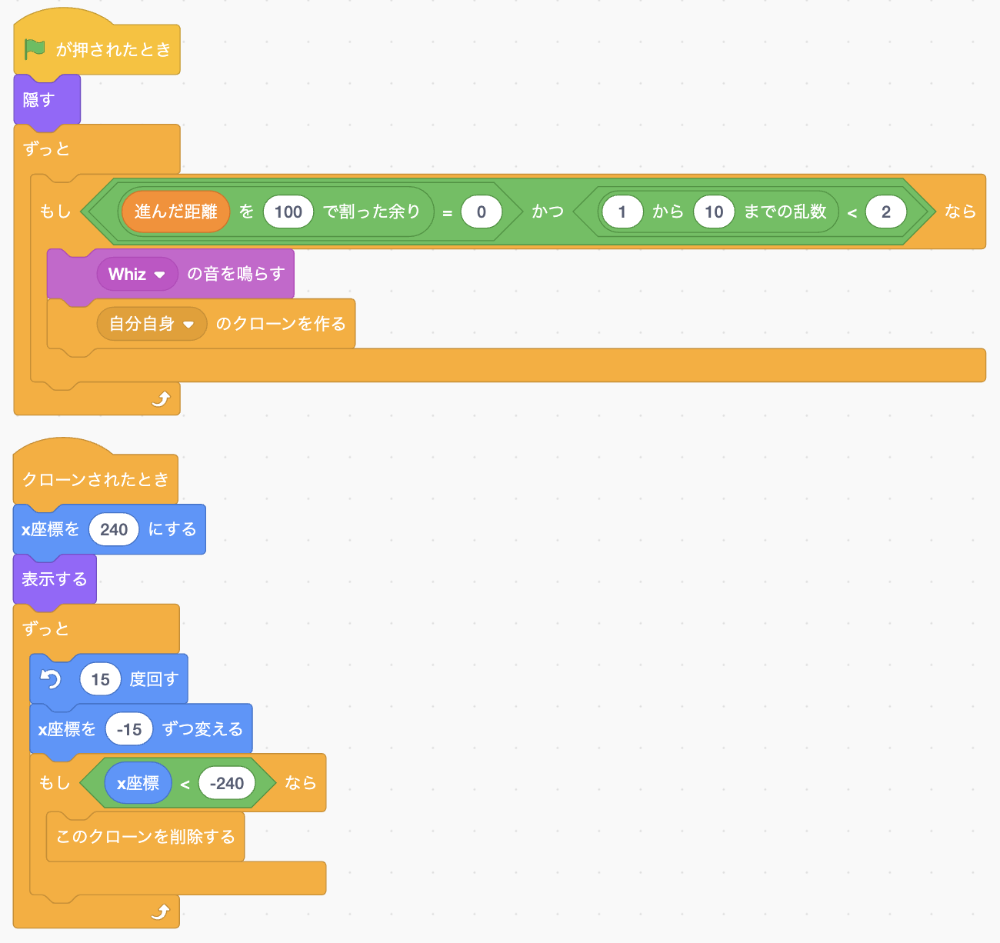
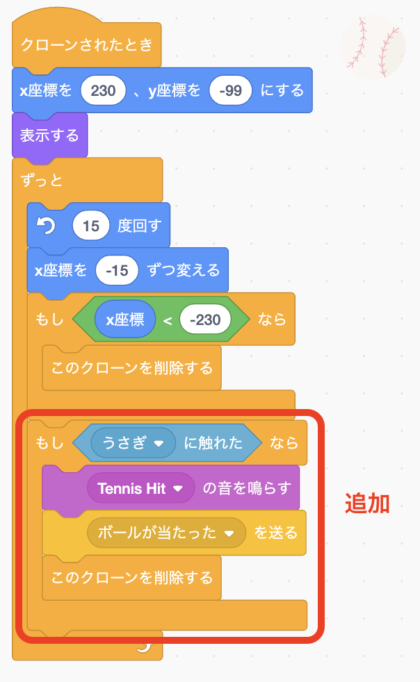
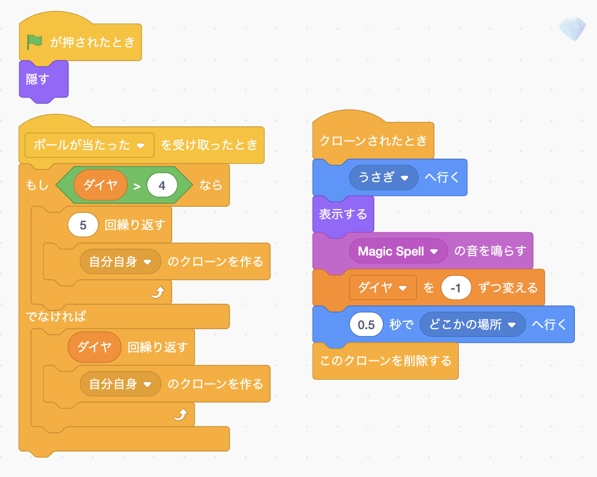
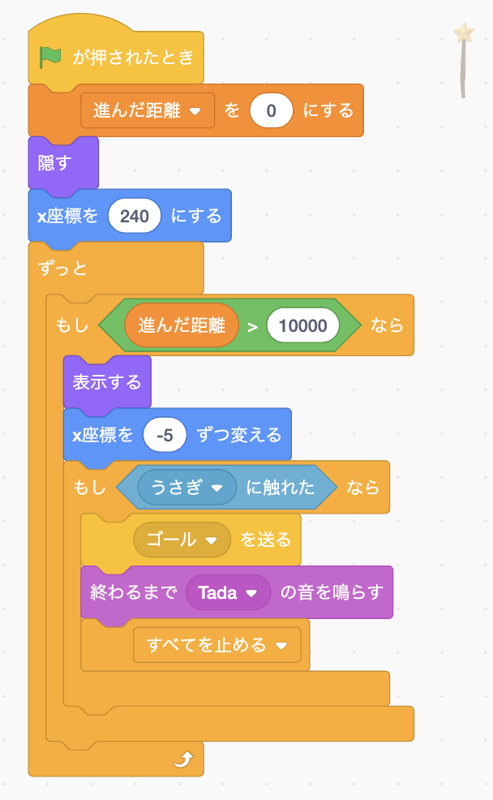
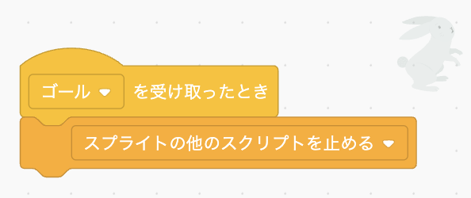
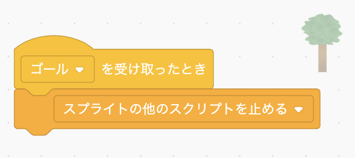
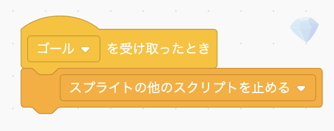
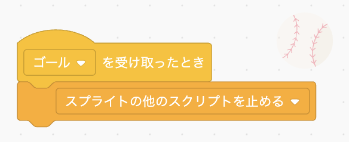

# <ruby>秋鹿学<rt>あいかまな</rt></ruby>びラボ プログラミング<ruby>教室<rt>きょうしつ</rt></ruby>

## <ruby>横<rt>よこ</rt></ruby>スクロールアクションゲームを<ruby>作<rt>つく</rt></ruby>ってみよう

<ruby>今<rt>いま</rt></ruby>までに<ruby>習<rt>なら</rt></ruby>ったことを<ruby>使<rt>つか</rt></ruby>って、<ruby>以下<rt>いか</rt></ruby>のような<ruby>横<rt>よこ</rt></ruby>スクロールアクションゲームを<ruby>作<rt>つく</rt></ruby>ってみましょう。

- うさぎが<ruby>地面<rt>じめん</rt></ruby>を<ruby>走<rt>はし</rt></ruby>る
- <ruby>走<rt>はし</rt></ruby>っていると<ruby>木<rt>き</rt></ruby>が<ruby>通<rt>とお</rt></ruby>り<ruby>過<rt>す</rt></ruby>ぎていく
- スペースキーでうさぎがジャンプする
- <ruby>宙<rt>ちゅう</rt></ruby>に<ruby>浮<rt>う</rt></ruby>いているダイヤを<ruby>集<rt>あつ</rt></ruby>める
- たまにボールが<ruby>飛<rt>と</rt></ruby>んでくる
- ボールに<ruby>当<rt>あた</rt></ruby>たるとダイヤを<ruby>落<rt>お</rt></ruby>とす
- ゴールしたらプログラムを<ruby>止<rt>と</rt></ruby>める

## うさぎが<ruby>地面<rt>じめん</rt></ruby>を<ruby>走<rt>はし</rt></ruby>る

「<ruby>地面<rt>じめん</rt></ruby>を<ruby>走<rt>はし</rt></ruby>る」といっても、うさぎを<ruby>移動<rt>いどう</rt></ruby>させてしまうとすぐに<ruby>画面<rt>がめん</rt></ruby>の<ruby>幅<rt>はば</rt></ruby>が<ruby>足<rt>た</rt></ruby>りなくなってしまいます。

うさぎはその<ruby>場<rt>ば</rt></ruby>で<ruby>足踏<rt>あしぶ</rt></ruby>みするようにして、<ruby>背景<rt>はいけい</rt></ruby>を<ruby>動<rt>うご</rt></ruby>かすことで<ruby>走<rt>はし</rt></ruby>っているように<ruby>見<rt>み</rt></ruby>せることができます。

ただし、<ruby>smalruby<rt>スモウルビー</rt></ruby>のステージに<ruby>設定<rt>せってい</rt></ruby>した<ruby>背景画像<rt>はいけいがぞう</rt></ruby>は<ruby>動<rt>うご</rt></ruby>かすことができませんので、<ruby>動<rt>うご</rt></ruby>く<ruby>背景<rt>はいけい</rt></ruby>もスプライトで<ruby>表現<rt>ひょうげん</rt></ruby>します。

まず、うさぎと<ruby>地面<rt>じめん</rt></ruby>と<ruby>背景<rt>はいけい</rt></ruby>を<ruby>以下<rt>いか</rt></ruby>のように<ruby>設置<rt>せっち</rt></ruby>し、うさぎが<ruby>足踏<rt>あしぶ</rt></ruby>みするプログラムを<ruby>作<rt>つく</rt></ruby>りましょう。

- ステージの<ruby>背景<rt>はいけい</rt></ruby>に「<ruby>Blue<rt>ブルー</rt></ruby> <ruby>Sky<rt>スカイ</rt></ruby> 2」を<ruby>選<rt>えら</rt></ruby>び、<ruby>緑<rt>みどり</rt></ruby>の<ruby>草<rt>くさ</rt></ruby>と<ruby>茶色<rt>ちゃいろ</rt></ruby>の<ruby>土<rt>つち</rt></ruby>を<ruby>描<rt>か</rt></ruby>く
- <ruby>背景<rt>はいけい</rt></ruby>の<ruby>土<rt>つち</rt></ruby>と<ruby>同<rt>おな</rt></ruby>じ<ruby>色<rt>いろ</rt></ruby>のスプライトを「<ruby>地面<rt>じめん</rt></ruby>」という<ruby>名前<rt>なまえ</rt></ruby>で<ruby>作<rt>つく</rt></ruby>る
- 「<ruby>Rabbit<rt>ラビット</rt></ruby>」という<ruby>画像<rt>がぞう</rt></ruby>のスプライトを<ruby>追加<rt>ついか</rt></ruby>して「うさぎ」という<ruby>名前<rt>なまえ</rt></ruby>にする
  - <ruby>大<rt>おお</rt></ruby>きさは 50 にする
- うさぎが<ruby>足踏<rt>あしぶ</rt></ruby>みするプログラムは、コスチュームの「<ruby>rabbit<rt>ラビット</rt></ruby>-a」と「<ruby>rabbit<rt>ラビット</rt></ruby>-b」を<ruby>交互<rt>こうご</rt></ruby>に<ruby>切<rt>き</rt></ruby>り<ruby>替<rt>か</rt></ruby>える
  - すぐに<ruby>切<rt>き</rt></ruby>り<ruby>替<rt>か</rt></ruby>えると<ruby>動<rt>うご</rt></ruby>きが<ruby>速<rt>はや</rt></ruby>すぎるので 0.1<ruby>秒<rt>びょう</rt></ruby>ずつ<ruby>待<rt>ま</rt></ruby>っている

## <ruby>走<rt>はし</rt></ruby>っていると<ruby>木<rt>き</rt></ruby>が<ruby>通<rt>とお</rt></ruby>り<ruby>過<rt>す</rt></ruby>ぎていく

<ruby>背景<rt>はいけい</rt></ruby>が<ruby>動<rt>うご</rt></ruby>いてうさぎが<ruby>走<rt>はし</rt></ruby>っているように<ruby>見<rt>み</rt></ruby>せるため、<ruby>木<rt>き</rt></ruby>が<ruby>通<rt>とお</rt></ruby>り<ruby>過<rt>す</rt></ruby>ぎるようにします。

ある<ruby>程度距離<rt>ていどきょり</rt></ruby>が<ruby>進<rt>すす</rt></ruby>むたびに<ruby>木<rt>き</rt></ruby>が<ruby>右<rt>みぎ</rt></ruby>から<ruby>出<rt>で</rt></ruby>てきて<ruby>左<rt>ひだり</rt></ruby>に<ruby>移動<rt>いどう</rt></ruby>し、<ruby>画面端<rt>がめんはし</rt></ruby>で<ruby>消<rt>き</rt></ruby>えるようにします。

- 「<ruby>Tree<rt>ツリー</rt></ruby> 1」のスプライトを<ruby>追加<rt>ついか</rt></ruby>し、「<ruby>木<rt>き</rt></ruby>」という<ruby>名前<rt>なまえ</rt></ruby>にする
- <ruby>木<rt>き</rt></ruby>は<ruby>背景<rt>はいけい</rt></ruby>の<ruby>緑<rt>みどり</rt></ruby>の<ruby>草<rt>くさ</rt></ruby>のところに<ruby>立<rt>た</rt></ruby>つように<ruby>置<rt>お</rt></ruby>く
- どれくらい<ruby>進<rt>すす</rt></ruby>んだかを<ruby>記録<rt>きろく</rt></ruby>するために「<ruby>進<rt>すす</rt></ruby>んだ<ruby>距離<rt>きょり</rt></ruby>」という<ruby>変数<rt>へんすう</rt></ruby>を<ruby>作<rt>つく</rt></ruby>る
- うさぎのプログラムで、ゲーム<ruby>開始時<rt>かいしじ</rt></ruby>に「<ruby>進<rt>すす</rt></ruby>んだ<ruby>距離<rt>きょり</rt></ruby>」を 0 にし、ゲームが<ruby>進<rt>すす</rt></ruby>むごとに<ruby>少<rt>すこ</rt></ruby>しずつ<ruby>増<rt>ふ</rt></ruby>やす
- <ruby>木<rt>き</rt></ruby>のプログラムで、<ruby>進<rt>すす</rt></ruby>んだ<ruby>距離<rt>きょり</rt></ruby>が 200<ruby>増<rt>ふ</rt></ruby>えるたびに<ruby>木<rt>き</rt></ruby>が<ruby>出<rt>で</rt></ruby>てくるようにする

> うさぎと<ruby>木<rt>き</rt></ruby>がすれ<ruby>違<rt>ちが</rt></ruby>うときに、<ruby>木<rt>き</rt></ruby>がうさぎの<ruby>前<rt>まえ</rt></ruby>に<ruby>来<rt>き</rt></ruby>てしまう<ruby>場合<rt>ばあい</rt></ruby>はうさぎのコードブロックで「<ruby>最前面<rt>さいぜんめん</rt></ruby>へ<ruby>移動<rt>いどう</rt></ruby>する」をクリックするとうさぎが<ruby>手前<rt>てまえ</rt></ruby>になります。

## スペースキーでうさぎがジャンプする

ジャンプは<ruby>上向<rt>うえむ</rt></ruby>きに<ruby>移動<rt>いどう</rt></ruby>したあと<ruby>重力<rt>じゅうりょく</rt></ruby>によって<ruby>落下<rt>らっか</rt></ruby>し、<ruby>地面<rt>じめん</rt></ruby>に<ruby>着地<rt>ちゃくち</rt></ruby>します。

<ruby>地面<rt>じめん</rt></ruby>に<ruby>触<rt>ふ</rt></ruby>れていない<ruby>間<rt>あいだ</rt></ruby>はずっと<ruby>下<rt>した</rt></ruby>に<ruby>移動<rt>いどう</rt></ruby>するプログラムで<ruby>重力<rt>じゅうりょく</rt></ruby>を<ruby>表現<rt>ひょうげん</rt></ruby>します。

うさぎのプログラムに<ruby>新<rt>あたら</rt></ruby>しく<ruby>追加<rt>ついか</rt></ruby>します。
（<ruby>走<rt>はし</rt></ruby>るプログラムや<ruby>進<rt>すす</rt></ruby>んだ<ruby>距離<rt>きょり</rt></ruby>のプログラムとは<ruby>別<rt>べつ</rt></ruby>に<ruby>追加<rt>ついか</rt></ruby>します）

- <ruby>地面<rt>じめん</rt></ruby>に<ruby>触<rt>ふ</rt></ruby>れていない<ruby>間<rt>あいだ</rt></ruby>は<ruby>下<rt>した</rt></ruby>に<ruby>移動<rt>いどう</rt></ruby>する
- <ruby>地面<rt>じめん</rt></ruby>に<ruby>触<rt>ふ</rt></ruby>れているときにスペースキーを押したら
  - <ruby>Jump<rt>ジャンプ</rt></ruby> の<ruby>音<rt>おと</rt></ruby>を<ruby>鳴<rt>な</rt></ruby>らす
    - うさぎのスプライトに Jump の<ruby>音<rt>おと</rt></ruby>は<ruby>入<rt>はい</rt></ruby>っていないので<ruby>追加<rt>ついか</rt></ruby>する
  - コスチュームを「<ruby>rabbit<rt>ラビット</rt></ruby>-c」にする
  - <ruby>上方向<rt>うえほうこう</rt></ruby>に<ruby>移動<rt>いどう</rt></ruby>する

また、<ruby>走<rt>はし</rt></ruby>るプログラムでは<ruby>地面<rt>じめん</rt></ruby>に<ruby>触<rt>ふ</rt></ruby>れているときのみコスチュームを<ruby>切<rt>き</rt></ruby>り<ruby>替<rt>か</rt></ruby>えるようにします。

## <ruby>宙<rt>ちゅう</rt></ruby>に<ruby>浮<rt>う</rt></ruby>いているダイヤを<ruby>集<rt>あつ</rt></ruby>める

<ruby>木<rt>き</rt></ruby>と<ruby>同<rt>おな</rt></ruby>じにようにダイヤが<ruby>右<rt>みぎ</rt></ruby>から<ruby>左<rt>ひだり</rt></ruby>に<ruby>移動<rt>いどう</rt></ruby>するようにして、ジャンプしたうさぎが<ruby>触<rt>ふ</rt></ruby>れると<ruby>取<rt>と</rt></ruby>れるようにします。

<ruby>木<rt>き</rt></ruby>は<ruby>一定間隔<rt>いっていかんかく</rt></ruby>で<ruby>出<rt>だ</rt></ruby>すようにしていましたが、ダイヤはランダムに<ruby>現<rt>あらわ</rt></ruby>れるようにしてみましょう。

- 「<ruby>crystal<rt>クリスタル</rt></ruby>」のスプライトを<ruby>追加<rt>ついか</rt></ruby>し<ruby>名前<rt>なまえ</rt></ruby>を「ダイヤ」にする
- ダイヤはうさぎがジャンプしたら<ruby>取<rt>と</rt></ruby>れるくらいの<ruby>高<rt>たか</rt></ruby>さに<ruby>置<rt>お</rt></ruby>く
- <ruby>取<rt>と</rt></ruby>ったダイヤの<ruby>数<rt>かず</rt></ruby>を<ruby>記録<rt>きろく</rt></ruby>する「ダイヤ」<ruby>変数<rt>へんすう</rt></ruby>を<ruby>作<rt>つく</rt></ruby>る
- うさぎのプログラムで、ゲーム<ruby>開始時<rt>かいしじ</rt></ruby>にダイヤ<ruby>変数<rt>へんすう</rt></ruby>を 0 にする
- ダイヤのプログラムで、<ruby>進<rt>すす</rt></ruby>んだ<ruby>距離<rt>きょり</rt></ruby>が 50<ruby>増<rt>ふ</rt></ruby>えるたびに 20％の<ruby>確率<rt>かくりつ</rt></ruby>でダイヤが<ruby>現<rt>あらわ</rt></ruby>れ、<ruby>右<rt>みぎ</rt></ruby>から<ruby>左<rt>ひだり</rt></ruby>に<ruby>移動<rt>いどう</rt></ruby>するようにする
- ダイヤがうさぎに<ruby>当<rt>あ</rt></ruby>たったら、「<ruby>collect<rt>コレクト</rt></ruby>」の<ruby>音<rt>おと</rt></ruby>を<ruby>鳴<rt>な</rt></ruby>らしてダイヤ<ruby>変数<rt>へんすう</rt></ruby>を 1<ruby>増<rt>ふ</rt></ruby>やしてダイヤは<ruby>消<rt>き</rt></ruby>える

## たまにボールが<ruby>飛<rt>と</rt></ruby>んでくる

ボールもランダムに現れて右から左に飛んでいきます。

ダイヤよりも少し速く動くようにしてみましょう。

- <ruby>好<rt>す</rt></ruby>きなボールのスプライトを<ruby>追加<rt>ついか</rt></ruby>して<ruby>名前<rt>なまえ</rt></ruby>を「ボール」にする
- ボールの<ruby>大<rt>おお</rt></ruby>きさを「50」にして、うさぎと<ruby>同<rt>おな</rt></ruby>じ<ruby>高<rt>たか</rt></ruby>さに<ruby>置<rt>お</rt></ruby>く
- ボールのプログラムで、<ruby>進<rt>すす</rt></ruby>んだ<ruby>距離<rt>きょり</rt></ruby>が 100<ruby>増<rt>ふ</rt></ruby>えるたびに 10％の<ruby>確率<rt>かくりつ</rt></ruby>でボールが<ruby>現<rt>あらわ</rt></ruby>れ、<ruby>右<rt>みぎ</rt></ruby>から<ruby>左<rt>ひだり</rt></ruby>に<ruby>移動<rt>いどう</rt></ruby>するようにする
- ボールが<ruby>飛<rt>と</rt></ruby>ぶので<ruby>回転<rt>かいてん</rt></ruby>させたり、<ruby>飛<rt>と</rt></ruby>んでいるような<ruby>音<rt>おと</rt></ruby>もならしてみたりしましょう

## ボールに<ruby>当<rt>あた</rt></ruby>たるとダイヤを<ruby>落<rt>お</rt></ruby>とす

うさぎがボールに<ruby>当<rt>あ</rt></ruby>たったらダイヤを<ruby>落<rt>お</rt></ruby>とすようにします。

<ruby>落<rt>お</rt></ruby>としたことがわかるようにダイヤを<ruby>飛<rt>と</rt></ruby>び<ruby>散<rt>ち</rt></ruby>らせてみましょう。

- <ruby>落<rt>お</rt></ruby>としたダイヤは<ruby>普通<rt>ふつう</rt></ruby>のダイヤとは<ruby>違<rt>ちが</rt></ruby>う<ruby>動<rt>うご</rt></ruby>きをするので、<ruby>新<rt>あたら</rt></ruby>しく「<ruby>crystal<rt>クリスタル</rt></ruby>」のスプライトをもう<ruby>一<rt>ひと</rt></ruby>つ<ruby>追加<rt>ついか</rt></ruby>して<ruby>名前<rt>なまえ</rt></ruby>を「<ruby>落<rt>お</rt></ruby>としたダイヤ」にする
- ボールのプログラムで、うさぎに<ruby>当<rt>あ</rt></ruby>たったら<ruby>音<rt>おと</rt></ruby>がなって、「ボールに<ruby>当<rt>あ</rt></ruby>たった」メッセージを<ruby>飛<rt>と</rt></ruby>ばし、ボールは<ruby>消<rt>き</rt></ruby>えるようにする
- <ruby>落<rt>お</rt></ruby>としたダイヤのプログラムで<ruby>以下<rt>いか</rt></ruby>のことをする
  - ゲームが<ruby>始<rt>はじ</rt></ruby>まったときは<ruby>見<rt>み</rt></ruby>えなくする
  - 「ボールに<ruby>当<rt>あ</rt></ruby>たった」メッセージを<ruby>受<rt>う</rt></ruby>け<ruby>取<rt>と</rt></ruby>ったら、うさぎのいる<ruby>場所<rt>ばしょ</rt></ruby>から<ruby>落<rt>お</rt></ruby>としたダイヤが<ruby>飛<rt>と</rt></ruby>び<ruby>散<rt>ち</rt></ruby>り、ダイヤ<ruby>変数<rt>へんすう</rt></ruby>の<ruby>数値<rt>すうち</rt></ruby>を<ruby>減<rt>へ</rt></ruby>らす

> <ruby>飛<rt>と</rt></ruby>び<ruby>散<rt>ち</rt></ruby>らせるときは「◯<ruby>秒<rt>びょう</rt></ruby>でどこかの<ruby>場所<rt>ばしょ</rt></ruby>へ<ruby>行<rt>いｋ</rt></ruby>く」ブロックを<ruby>使<rt>つか</rt></ruby>うと<ruby>簡単<rt>かんたん</rt></ruby>です

## ゴールしたらプログラムを<ruby>止<rt>と</rt></ruby>める

ある<ruby>程度進<rt>ていどすす</rt></ruby>んだらゴールを<ruby>出<rt>だ</rt></ruby>してゲームを<ruby>終了<rt>しゅうりょう</rt></ruby>させます。

- 「<ruby>Wand<rt>ワンド</rt></ruby>」のスプライトを<ruby>追加<rt>ついか</rt></ruby>して<ruby>名前<rt>なまえ</rt></ruby>を「ゴール」にし、<ruby>大<rt>おお</rt></ruby>きさを「200」にしてうさぎがジャンプでも<ruby>飛<rt>と</rt></ruby>び<ruby>越<rt>こ</rt></ruby>せない<ruby>場所<rt>ばしょ</rt></ruby>に<ruby>置<rt>お</rt></ruby>く
- 「<ruby>進<rt>すす</rt></ruby>んだ<ruby>距離<rt>きょり</rt></ruby>」が 10000 を<ruby>超<rt>こ</rt></ruby>えたらゴールが<ruby>現<rt>あらわ</rt></ruby>れて<ruby>右<rt>みぎ</rt></ruby>から<ruby>左<rt>ひだり</rt></ruby>に<ruby>移動<rt>いどう</rt></ruby>する
- ゴールがうさぎに<ruby>当<rt>あ</rt></ruby>たったらゲームを<ruby>終了<rt>しゅうりょう</rt></ruby>する

> ゴールをしたときに<ruby>音<rt>おと</rt></ruby>をならすなどの<ruby>演出<rt>えんしゅつ</rt></ruby>をするときは、すぐにプログラムを止めずに<ruby>演出<rt>えんしゅつ</rt></ruby>が<ruby>終<rt>お</rt></ruby>わるまで<ruby>待<rt>ま</rt></ruby>つ<ruby>必要<rt>ひつよう</rt></ruby>があります。
>
> その<ruby>間<rt>あいだ</rt></ruby>に<ruby>他<rt>ほか</rt></ruby>のプログラムが<ruby>動<rt>うご</rt></ruby>かないようにメッセージを<ruby>飛<rt>と</rt></ruby>ばして<ruby>他<rt>ほか</rt></ruby>のスプライトの<ruby>動<rt>うご</rt></ruby>きを<ruby>止<rt>と</rt></ruby>めるとよいです。
