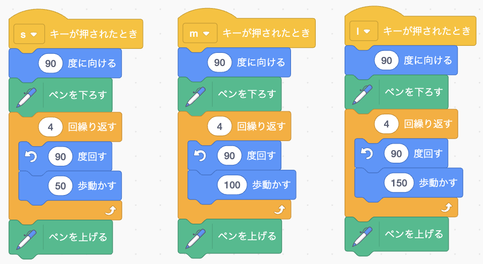
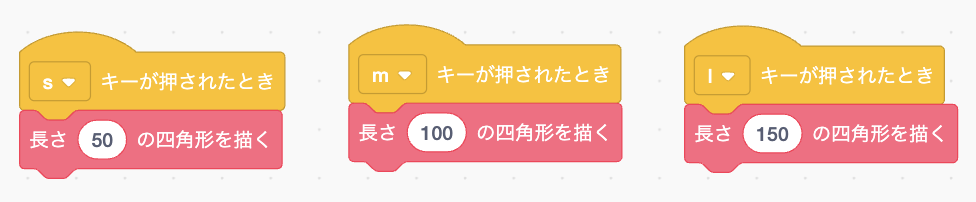
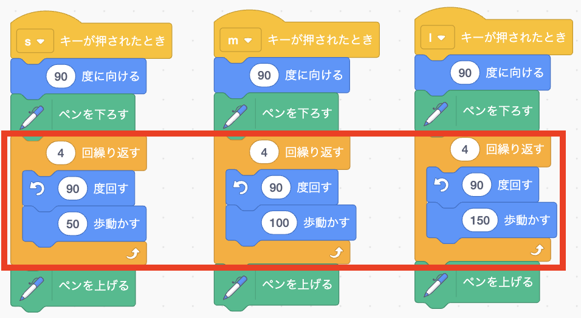
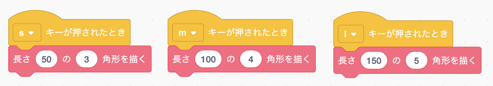
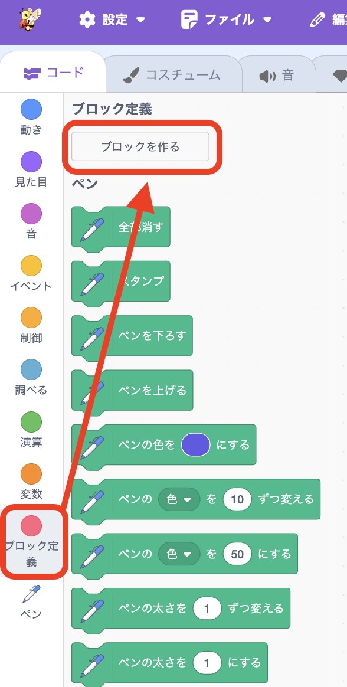
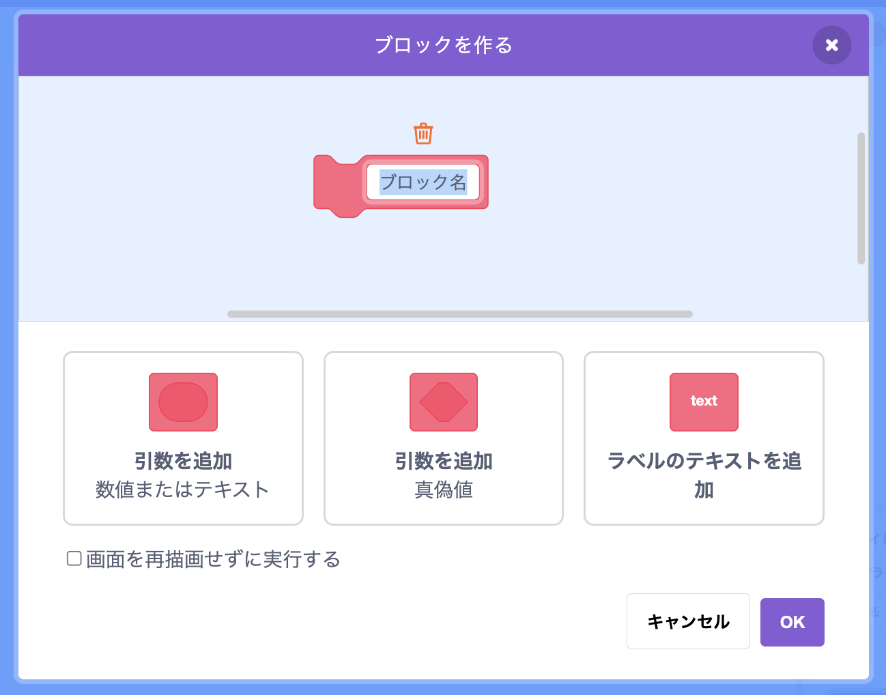
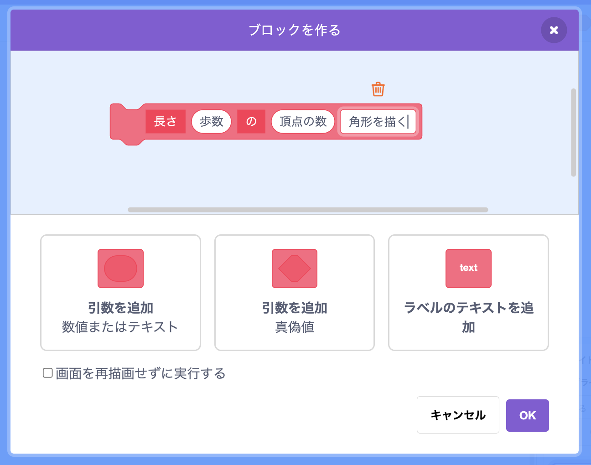
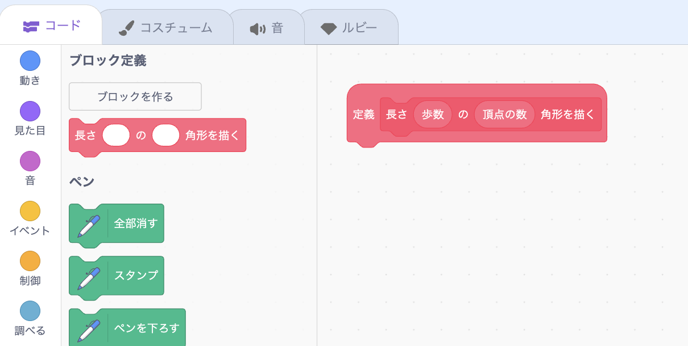
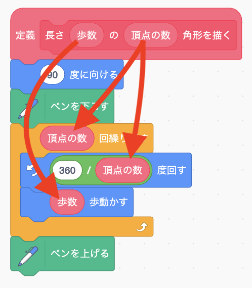
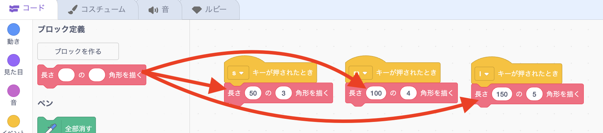

# <ruby>秋鹿学<rt>あいかまな</rt></ruby>びラボ プログラミング<ruby>教室<rt>きょうしつ</rt></ruby>
## <ruby>関数<rt>かんすう</rt></ruby>を<ruby>使<rt>つか</rt></ruby>ってみよう

<ruby>今回<rt>こんかい</rt></ruby>は「<ruby>関数<rt>かんすう</rt></ruby>」というものを<ruby>使<rt>つか</rt></ruby>ってみましょう。

### <ruby>関数<rt>かんすう</rt></ruby>？

<ruby>関数<rt>かんすう</rt></ruby>とは、 **プログラムのまとまりに<ruby>名前<rt>なまえ</rt></ruby>をつけるためのものです。**

プログラムに<ruby>名前<rt>なまえ</rt></ruby>をつけてまとめることで、いろいろなところで<ruby>同<rt>おな</rt></ruby>じプログラムを<ruby>動<rt>うご</rt></ruby>かすことができます。

また、プログラムを<ruby>変更<rt>へんこう</rt></ruby>をするときに、<ruby>変更<rt>へんこう</rt></ruby>するのが1か<ruby>所<rt>しょ</rt></ruby>で<ruby>済<rt>す</rt></ruby>むようになります。

<ruby>以下<rt>いか</rt></ruby>のような<ruby>場合<rt>ばあい</rt></ruby>に<ruby>関数<rt>かんすう</rt></ruby>を<ruby>使用<rt>しよう</rt></ruby>します。

* ひと<ruby>目見<rt>めみ</rt></ruby>ただけでは<ruby>何<rt>なに</rt></ruby>をするプログラムなのかわかりにくいとき
* <ruby>長<rt>なが</rt></ruby>いプログラムを<ruby>分<rt>わ</rt></ruby>けて<ruby>見<rt>み</rt></ruby>やすくしたいとき
* よく<ruby>似<rt>に</rt></ruby>たプログラムが2つ<ruby>以上<rt>いじょう</rt></ruby>あるとき

### <ruby>関数<rt>かんすう</rt></ruby>の<ruby>使用例<rt>しようれい</rt></ruby>

たとえば、<ruby>次<rt>つぎ</rt></ruby>のようなプログラムを<ruby>例<rt>れい</rt></ruby>に<ruby>関数<rt>かんすう</rt></ruby>の<ruby>使<rt>つか</rt></ruby>い<ruby>方<rt>かた</rt></ruby>を<ruby>見<rt>み</rt></ruby>てみましょう。

このプログラムを<ruby>動<rt>うご</rt></ruby>かすとどうなるか<ruby>考<rt>かんが</rt></ruby>えてみましょう。

* <ruby>S<rt>エス</rt></ruby>キーが<ruby>押<rt>お</rt></ruby>されたとき
  - 90<ruby>度<rt>ど</rt></ruby>なので<ruby>右<rt>みぎ</rt></ruby>を<ruby>向<rt>む</rt></ruby>く
  - ペンを<ruby>下<rt>お</rt></ruby>ろしたのでなにか<ruby>描<rt>か</rt></ruby>くのかな
  - <ruby>向<rt>む</rt></ruby>きを90<ruby>度変<rt>どか</rt></ruby>えて50<ruby>歩動<rt>ぽうご</rt></ruby>くのを4<ruby>回繰<rt>かいく</rt></ruby>り<ruby>返<rt>かえ</rt></ruby>しているので<ruby>四角形<rt>しかくけい</rt></ruby>が<ruby>描<rt>か</rt></ruby>かれそう
  - ペンを<ruby>上<rt>あ</rt></ruby>げたので<ruby>線<rt>せん</rt></ruby>が<ruby>引<rt>ひ</rt></ruby>かれるのはここまで。やっぱり<ruby>四角形<rt>しかくけい</rt></ruby>を<ruby>描<rt>か</rt></ruby>くプログラムだ

というように、ひとつひとつのブロックを<ruby>見<rt>み</rt></ruby>て<ruby>考<rt>かんが</rt></ruby>えないと<ruby>何<rt>なに</rt></ruby>をするプログラムなのかわかりません。

では、<ruby>関数<rt>かんすう</rt></ruby>を<ruby>使<rt>つか</rt></ruby>ってこのようなプログラムになっていたらどうでしょう。

<ruby>赤<rt>あか</rt></ruby>いブロックが<ruby>関数<rt>かんすう</rt></ruby>です。

<ruby>関数<rt>かんすう</rt></ruby>ブロックにどんなプログラムか<ruby>書<rt>か</rt></ruby>いてあるので、パッと見ただけで何が起こるのかわかりますね。

もしも<ruby>関数<rt>かんすう</rt></ruby>を<ruby>使<rt>つか</rt></ruby>っていないプログラムで、<ruby>四角形<rt>しかくけい</rt></ruby>ではなく、<ruby>三角形<rt>さんかくけい</rt></ruby>や<ruby>五角形<rt>ごかくけい</rt></ruby>を<ruby>描<rt>か</rt></ruby>くように<ruby>変<rt>か</rt></ruby>えたくなったらどうしましょう。

<ruby>赤枠<rt>あかわく</rt></ruby>の<ruby>四角形<rt>しかくけい</rt></ruby>を<ruby>描<rt>か</rt></ruby>いている<ruby>部分<rt>ぶぶん</rt></ruby>を3か<ruby>所<rt>しょ</rt></ruby>とも<ruby>変更<rt>へんこう</rt></ruby>しないといけません。

<ruby>関数<rt>かんすう</rt></ruby>を<ruby>使<rt>つか</rt></ruby>えば<ruby>一<rt>ひと</rt></ruby>つのプログラムで、<ruby>三角形<rt>さんかくけい</rt></ruby>でも<ruby>四角形<rt>しかくけい</rt></ruby>でも<ruby>五角形<rt>ごかくけい</rt></ruby>でも<ruby>描<rt>か</rt></ruby>けるようになります。

### <ruby>関数<rt>かんすう</rt></ruby>の<ruby>作<rt>つく</rt></ruby>り<ruby>方<rt>かた</rt></ruby>

<ruby>関数<rt>かんすう</rt></ruby>を<ruby>作<rt>つく</rt></ruby>るには、「コード」の「ブロック<ruby>定義<rt>ていぎ</rt></ruby>」にある「ブロックを<ruby>作<rt>つく</rt></ruby>る」をクリックします。

<ruby>関数<rt>かんすう</rt></ruby>を<ruby>作<rt>つく</rt></ruby>るための<ruby>画面<rt>がめん</rt></ruby>が<ruby>出<rt>で</rt></ruby>てきます。

- 「<ruby>引数<rt>ひきすう</rt></ruby>」というのは<ruby>関数<rt>かんすう</rt></ruby>に<ruby>渡<rt>わた</rt></ruby>す<ruby>文字<rt>もじ</rt></ruby>や<ruby>数値<rt>すうち</rt></ruby>などです
- 「ラベルのテキスト」というのは<ruby>関数<rt>かんすう</rt></ruby>の<ruby>名前<rt>なまえ</rt></ruby>や<ruby>説明<rt>せつめい</rt></ruby>を<ruby>書<rt>か</rt></ruby>くところです

<ruby>引数<rt>ひきすう</rt></ruby>とラベルのテキストを<ruby>追加<rt>ついか</rt></ruby>して<ruby>以下<rt>いか</rt></ruby>のように<ruby>関数<rt>かんすう</rt></ruby>の<ruby>定義<rt>ていぎ</rt></ruby>を<ruby>作<rt>つく</rt></ruby>って<ruby>OK<rt>オーケー</rt></ruby>を<ruby>押<rt>お</rt></ruby>します。

そうすると<ruby>関数<rt>かんすう</rt></ruby>の<ruby>中身<rt>なかみ</rt></ruby>のプログラムを<ruby>書<rt>か</rt></ruby>くための<ruby>定義<rt>ていぎ</rt></ruby>ブロックが<ruby>出<rt>で</rt></ruby>てきます。

<ruby>以下<rt>いか</rt></ruby>のように<ruby>引数<rt>ひきすう</rt></ruby>で<ruby>受<rt>う</rt></ruby>け<ruby>取<rt>と</rt></ruby>った<ruby>歩数<rt>ほすう</rt></ruby>や<ruby>頂点<rt>ちょうてん</rt></ruby>の<ruby>数<rt>かず</rt></ruby>で<ruby>図形<rt>ずけい</rt></ruby>を<ruby>描<rt>か</rt></ruby>くプログラムを作ります。

<ruby>引数<rt>ひきすう</rt></ruby>を<ruby>使<rt>つか</rt></ruby>うときは<ruby>定義<rt>ていぎ</rt></ruby>のところにある<ruby>引数<rt>ひきすう</rt></ruby>の<ruby>名前<rt>なまえ</rt></ruby>を<ruby>引<rt>ひ</rt></ruby>っぱって<ruby>持<rt>も</rt></ruby>っていきます。

<ruby>関数<rt>かんすう</rt></ruby>ができたら、あとは<ruby>他<rt>ほか</rt></ruby>のブロックを<ruby>使<rt>つか</rt></ruby>うときと<ruby>同<rt>おな</rt></ruby>じように<ruby>使<rt>つか</rt></ruby>えます。

> <ruby>関数<rt>かんすう</rt></ruby>の<ruby>作<rt>つく</rt></ruby>り<ruby>方<rt>かた</rt></ruby>・<ruby>使<rt>つか</rt></ruby>い<ruby>方<rt>かた</rt></ruby>がわかったら、<ruby>今<rt>いま</rt></ruby>まで<ruby>自分<rt>じぶん</rt></ruby>が<ruby>作<rt>つく</rt></ruby>ったプログラムで、<ruby>関数<rt>かんすう</rt></ruby>にしたほうが<ruby>良<rt>よ</rt></ruby>さそうなところがあれば<ruby>関数<rt>かんすう</rt></ruby>にしてみましょう。
>
> これから<ruby>新<rt>あたら</rt></ruby>しいプログラムを<ruby>作<rt>つく</rt></ruby>るときも<ruby>関数<rt>かんすう</rt></ruby>を<ruby>使<rt>つか</rt></ruby>って<ruby>読<rt>よ</rt></ruby>みやすく、<ruby>変更<rt>へんこう</rt></ruby>しやすく<ruby>作<rt>つく</rt></ruby>りましょう。
