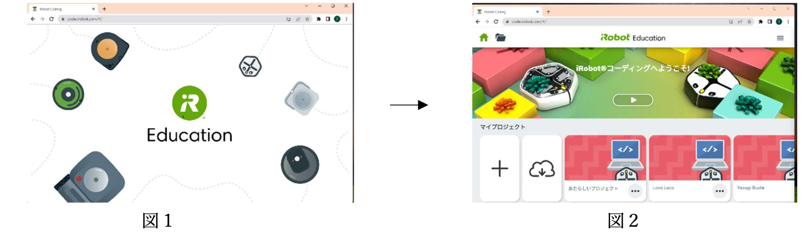

# iRobot Root プログラミング ― 秋鹿学びラボ

## プログラミングの準備

ブラウザを<ruby>開<rt>ひら</rt></ruby>いて、アドレスバーに `code.irobot.com` と<ruby>入力<rt>にゅうりょく</rt></ruby>して <ruby>Enter<rt>エンター</rt></ruby> キーを<ruby>押<rt>お</rt></ruby>します。

<ruby>図<rt>ず</rt></ruby>1が<ruby>表示<rt>ひょうじ</rt></ruby>されます。しばらくすると、<ruby>右<rt>みぎ</rt></ruby>の<ruby>図<rt>ず</rt></ruby>2が<ruby>表示<rt>ひょうじ</rt></ruby>されます。

<ruby>表示<rt>ひょうじ</rt></ruby>を<ruby>日本語<rt>にほんご</rt></ruby>に<ruby>設定<rt>せってい</rt></ruby>します。<ruby>三本線<rt>さんぼんせん</rt></ruby>のアイコンをクリックして、<ruby>Language<rt>ランゲージ</rt></ruby> を<ruby>選<rt>えら</rt></ruby>んで、にほんごを<ruby>選<rt>えら</rt></ruby>びます。

<ruby>元<rt>もと</rt></ruby>の<ruby>画面<rt>がめん</rt></ruby>に<ruby>戻<rt>もど</rt></ruby>ります。マイプロジェクトから+をクリックして、プログラミング<ruby>画面<rt>がめん</rt></ruby>にします。

## さぁ、はじめよう

<ruby>smalruby<rt>スモールビー</rt></ruby> と<ruby>画面<rt>がめん</rt></ruby>の<ruby>見<rt>み</rt></ruby>ためは<ruby>違<rt>ちが</rt></ruby>うけど、やり<ruby>方<rt>かた</rt></ruby>はだいたい<ruby>同<rt>おな</rt></ruby>じだよ。いろいろ<ruby>試<rt>ため</rt></ruby>してみよう！

① ブロックを<ruby>置<rt>お</rt></ruby>く<ruby>場所<rt>ばしょ</rt></ruby>。 
② ロボットの<ruby>動作<rt>どうさ</rt></ruby>を<ruby>事前<rt>じぜん</rt></ruby>に<ruby>画面<rt>がめｎ</rt></ruby>で<ruby>確認<rt>かくにん</rt></ruby>できるよ。(プレビュー<ruby>画面<rt>がめん</rt></ruby>) 
③ プログラムの<ruby>開始<rt>かいし</rt></ruby>ボタン(<ruby>再生<rt>さいせい</rt></ruby>ボタン)。その<ruby>下<rt>した</rt></ruby>は<ruby>停止<rt>ていし</rt></ruby>ボタン。  
④ <ruby>表示<rt>ひょうじ</rt></ruby>を<ruby>最初<rt>さいしょ</rt></ruby>の<ruby>状態<rt>じょうたい</rt></ruby>に<ruby>戻<rt>もど</rt></ruby>すよ。 
⑤ <ruby>今回<rt>こんかい</rt></ruby>は<ruby>使<rt>つか</rt></ruby>いません。 
⑥ ブロックを<ruby>置<rt>お</rt></ruby>く<ruby>場所<rt>ばしょ</rt></ruby>の<ruby>表示<rt>ひょうじ</rt></ruby>を<ruby>大<rt>おお</rt></ruby>きくしたり<ruby>小<rt>ちい</rt></ruby>さくしたりできるよ。 
⑦ プログラムのレベル。<ruby>今回<rt>こんかい</rt></ruby>はレベル1しか<ruby>使<rt>つか</rt></ruby>いません。 
⑧ ブロックの<ruby>種類<rt>しゅるい</rt></ruby>を<ruby>選<rt>えら</rt></ruby>べるよ。<ruby>色<rt>いろ</rt></ruby>もヒントだよ。 
⑨ このブロックを<ruby>使<rt>つか</rt></ruby>ってプログラムするよ。 
⑩ ロボットに<ruby>接続<rt>せつぞく</rt></ruby>するよ。<ruby>詳<rt>くわ</rt></ruby>しいやり<ruby>方<rt>かた</rt></ruby>は<ruby>先生<rt>せんせい</rt></ruby>に<ruby>聞<rt>き</rt></ruby>いてね。 

<ruby>試<rt>ため</rt></ruby>してみよう!

プレビュー<ruby>画面<rt>がめん</rt></ruby>は、<ruby>3D<rt>スリーディー</rt></ruby> <ruby>表示<rt>ひょうじ</rt></ruby>もできるよ。

ブロックを<ruby>消<rt>け</rt></ruby>す<ruby>方法<rt>ほうほう</rt></ruby>も<ruby>探<rt>さが</rt></ruby>してみて。

## <ruby>各<rt>かく</rt></ruby>ブロックの<ruby>説明<rt>せつめい</rt></ruby>

<h3 style="background-color: rgb(56, 142, 212); color: white; padding-left: 10px">イベント</h3>

<ruby>開始<rt>かいし</rt></ruby>ボタンが<ruby>押<rt>お</rt></ruby>されたら、<ruby>右<rt>みぎ</rt></ruby>につながっているブロックを<ruby>順<rt>じゅん</rt></ruby>に<ruby>実行<rt>じっこう</rt></ruby>します。 

バンバーに<ruby>何<rt>なに</rt></ruby>かが<ruby>当<rt>あ</rt></ruby>たったら、<ruby>右<rt>みぎ</rt></ruby>につながっているブロックを<ruby>実行<rt>じっこう</rt></ruby>します。 クリックして、さらに<ruby>条件<rt>じょうけん</rt></ruby>を<ruby>追加<rt>ついか</rt></ruby>できます。 

ロボットの<ruby>下側<rt>したがわ</rt></ruby>の<ruby>状態<rt>じょうたい</rt></ruby>を<ruby>光<rt>ひかり</rt></ruby>センサーで<ruby>読<rt>よ</rt></ruby>み<ruby>取<rt>と</rt></ruby>ります。<ruby>緑<rt>みどり</rt></ruby>の<ruby>線<rt>せん</rt></ruby>があれば、<ruby>右<rt>みぎ</rt></ruby>につながっているブロックを<ruby>実行<rt>じっこう</rt></ruby>します。 
クリックしてさらに<ruby>条件<rt>じょうけん</rt></ruby>を<ruby>追加<rt>ついか</rt></ruby>できます。 

ロボットがタッチされたら、<ruby>右<rt>みぎ</rt></ruby>につながっているブロックを<ruby>実行<rt>じっこう</rt></ruby>します。 クリックしてさらに<ruby>条件<rt>じょうけん</rt></ruby>を<ruby>追加<rt>ついか</rt></ruby>できます。 

<h3 style="background-color: rgb(255, 200, 0); color: black; padding-left: 10px">コマンド</h3>

<ruby>前<rt>まえ</rt></ruby>に16cm<ruby>進<rt>すす</rt></ruby>みます。クリックして、<ruby>移動距離<rt>いどうきょり</rt></ruby>や<ruby>移動方向<rt>いどうほうこう</rt></ruby>を<ruby>変更<rt>へんこう</rt></ruby>します。 
<ruby>後<rt>うし</rt></ruby>ろに<ruby>進<rt>すす</rt></ruby>む<ruby>場合<rt>ばあい</rt></ruby>は、<ruby>距離<rt>きょり</rt></ruby>をマイナスにします。
 

<ruby>左<rt>ひだり</rt></ruby>を<ruby>向<rt>む</rt></ruby>きます。 
クリックして、<ruby>回転角度<rt>かいてんかくど</rt></ruby>を<ruby>変更<rt>へんこう</rt></ruby>できます。
 

<ruby>右<rt>みぎ</rt></ruby>を<ruby>向<rt>む</rt></ruby>きます。 
クリックして、<ruby>回転角度<rt>かいてんかくど</rt></ruby>を<ruby>変更<rt>へんこう</rt></ruby>できます。
 

<ruby>音<rt>おと</rt></ruby>を<ruby>鳴<rt>な</rt></ruby>らします。クリックして、<ruby>音<rt>おと</rt></ruby>の<ruby>高<rt>たか</rt></ruby>さや<ruby>長<rt>なが</rt></ruby>さを<ruby>変更<rt>へんこう</rt></ruby>できます。 
ロボットから<ruby>人間<rt>にんげん</rt></ruby>に<ruby>何<rt>なに</rt></ruby>か<ruby>伝<rt>つた</rt></ruby>えたい<ruby>時<rt>とき</rt></ruby>に<ruby>使<rt>つか</rt></ruby>うことが<ruby>多<rt>おお</rt></ruby>いです。
 

<h3 style="background-color: rgb(112, 189, 102); color: black; padding-left: 10px">セットちょっと<ruby>難<rt>むず</rt></ruby>しいコマンドをセットと<ruby>呼<rt>よ</rt></ruby>んでいます</h3>

ロボットのライトを<ruby>光<rt>ひか</rt></ruby>らせます。クリックして、<ruby>光<rt>ひか</rt></ruby>りかたや<ruby>色<rt>いろ</rt></ruby>を<ruby>変更<rt>へんこう</rt></ruby>できます。 
<ruby>次<rt>つぎ</rt></ruby>の<ruby>光<rt>ひか</rt></ruby>りかたの<ruby>指示<rt>しじ</rt></ruby>があるまでずっと<ruby>光<rt>ひか</rt></ruby>っているので、<ruby>消<rt>け</rt></ruby>したいときは<ruby>消<rt>けす</rt></ruby>すブロックを<ruby>入<rt>い</rt></ruby>れてください。 
ロボットの<ruby>状態<rt>じょうたい</rt></ruby>を<ruby>人間<rt>にんげん</rt></ruby>に<ruby>伝<rt>つた</rt></ruby>える<ruby>時<rt>とき</rt></ruby>に<ruby>使<rt>つか</rt></ruby>うことが<ruby>多<rt>おお</rt></ruby>いです。
 

マーカーを<ruby>降<rt>お</rt></ruby>ろして<ruby>線<rt>せん</rt></ruby>が<ruby>書<rt>か</rt></ruby>ける<ruby>状態<rt>じょうたい</rt></ruby>にします。 
クリックして、マーカーを<ruby>上<rt>あ</rt></ruby>げる/<ruby>下<rt>さ</rt></ruby>げるの<ruby>指示<rt>しじ</rt></ruby>と<ruby>線<rt>せん</rt></ruby>を<ruby>消<rt>け</rt></ruby>す<ruby>指示<rt>しじ</rt></ruby>が<ruby>出<rt>だ</rt></ruby>せます。
 

ずっと<ruby>前<rt>まえ</rt></ruby>に<ruby>進<rt>すす</rt></ruby>みます。<ruby>何<rt>なに</rt></ruby>かにあたったら<ruby>向<rt>む</rt></ruby>きを<ruby>変<rt>か</rt></ruby>えるなどのブロックと<ruby>組<rt>く</rt></ruby>み<ruby>合<rt>あ</rt></ruby>わせて<ruby>使<rt>つか</rt></ruby>います。 
クリックで、<ruby>速<rt>はや</rt></ruby>さや<ruby>向<rt>む</rt></ruby>きを<ruby>指定<rt>してい</rt></ruby>できます。 
<ruby>停止<rt>ていし</rt></ruby>したいときにも<ruby>使<rt>つか</rt></ruby>います。
 

<h3 style="background-color: rgb(124, 204, 187); color: black; padding-left: 10px">せいぎょ</h3>

このブロックに<ruby>挟<rt>はさ</rt></ruby>まれたブロックを<ruby>繰<rt>く</rt></ruby>り<ruby>返<rt>かえ</rt></ruby>します。クリックしてくり<ruby>返<rt>かえ</rt></ruby>し<ruby>回数<rt>かいすう</rt></ruby>を<ruby>変更<rt>へんこう</rt></ruby>できます。 
ずっと<ruby>繰<rt>く</rt></ruby>り<ruby>返<rt>かえ</rt></ruby>す<ruby>指定<rt>してい</rt></ruby>もできます。
 

1<ruby>秒待<rt>びょうま</rt></ruby>ちます。 
クリックして<ruby>待<rt>ま</rt></ruby>ち<ruby>時間<rt>じかん</rt></ruby>を<ruby>変更<rt>へんこう</rt></ruby>できます。
 

> ~<ruby>音<rt>おと</rt></ruby>の<ruby>表記<rt>ひょうき</rt></ruby>について~
>
> <ruby>日本<rt>にほん</rt></ruby>では、<ruby>音<rt>おと</rt></ruby>の<ruby>高<rt>たか</rt></ruby>さ(<ruby>音階<rt>おんかい</rt></ruby>)を「ド・レ・ミ・ファ・ソ・ラ・シ・ド」と<ruby>呼<rt>よ</rt></ruby>ぶことが<ruby>多<rt>おお</rt></ruby>いです。この「ド・レ・ミ・ファ・ソ・ラ・シ・ド」は<ruby>実<rt>じつ</rt></ruby>はイタリア<ruby>語<rt>ご</rt></ruby>です。<ruby>英語<rt>えいご</rt></ruby>では<ruby>音階<rt>おんかい</rt></ruby>を「C・D・E・F・G・A・B・C」と<ruby>書<rt>か</rt></ruby>きます。<ruby>日本<rt>にほん</rt></ruby>でも<ruby>音階<rt>おんかい</rt></ruby> を「ハ・ニ・ホ・ヘ・ト・イ・ロ・ハ」で<ruby>表現<rt>ひょうげん</rt></ruby>することがありますね。
>
> なぜ<ruby>音階<rt>おんかい</rt></ruby>は「ABC」や「イロハ」から<ruby>始<rt>はじ</rt></ruby>まらないのか<ruby>不思議<rt>ふしぎ</rt></ruby>ですね。<ruby>実<rt>じつ</rt></ruby>は、<ruby>音<rt>おと</rt></ruby>の<ruby>基準<rt>きじゅん</rt></ruby>は「ラ」「A」「イ」です。この<ruby>音<rt>おと</rt></ruby>は、 <ruby>赤<rt>あか</rt></ruby>ちゃんの<ruby>泣<rt>な</rt></ruby>き<ruby>声<rt>ごえ</rt></ruby>なんですよ。ちなみに、<ruby>時報<rt>じほう</rt></ruby>の<ruby>音<rt>おと</rt></ruby>も「ラ・ラ・ラ・ラー」です。

## <ruby>実践編<rt>じっせんへん</rt></ruby>（チャレンジ）

<ruby>実際<rt>じっさい</rt></ruby>のお<ruby>掃除<rt>そうじ</rt></ruby>ロボットと<ruby>同<rt>おな</rt></ruby>じように「<ruby>家中<rt>いえじゅう</rt></ruby>を<ruby>掃除<rt>そうじ</rt></ruby>する」<ruby>動<rt>うご</rt></ruby>きをするプログラムを<ruby>作<rt>つく</rt></ruby>ろう。

プログラムを<ruby>作<rt>つく</rt></ruby>る<ruby>場合<rt>ばあい</rt></ruby>、<ruby>大事<rt>だいじ</rt></ruby>なことは

1. <ruby>最初<rt>さいしょ</rt></ruby>に<ruby>基本的<rt>きほんてき</rt></ruby>な<ruby>動<rt>うご</rt></ruby>きを<ruby>作<rt>つく</rt></ruby>る
2. <ruby>少<rt>すこ</rt></ruby>しずつ<ruby>細<rt>こま</rt></ruby>かい<ruby>動<rt>うご</rt></ruby>きを<ruby>追加<rt>ついか</rt></ruby>する

ことです。

<ruby>最初<rt>さいしょ</rt></ruby>から<ruby>難<rt>むずか</rt></ruby>しいものを<ruby>作<rt>つく</rt></ruby>ろうとするとプログラミングに<ruby>失敗<rt>しっぱい</rt></ruby>します。どうやって<ruby>簡単<rt>かんたん</rt></ruby>にするかが<ruby>大事<rt>だいじ</rt></ruby>です。

1. <ruby>基本的<rt>きほんてき</rt></ruby>な<ruby>動<rt>うご</rt></ruby>き
    - <ruby>開始<rt>かいし</rt></ruby>ボタンが<ruby>押<rt>お</rt></ruby>されたら、ずっと<ruby>前<rt>まえ</rt></ruby>に<ruby>進<rt>すす</rt></ruby>む
2. <ruby>細<rt>こま</rt></ruby>かい<ruby>動<rt>うご</rt></ruby>き
    - バンパーに<ruby>何<rt>なに</rt></ruby>か<ruby>当<rt>あ</rt></ruby>たったら、<ruby>向<rt>む</rt></ruby>きを<ruby>変<rt>か</rt></ruby>える
    - バンバーの<ruby>右<rt>みぎ</rt></ruby>とバンバーの<ruby>左<rt>ひだり</rt></ruby>で、<ruby>変<rt>か</rt></ruby>える<ruby>向<rt>む</rt></ruby>きを<ruby>変更<rt>へんこう</rt></ruby>してください
3. <ruby>細<rt>こま</rt></ruby>かい<ruby>動<rt>うご</rt></ruby>き
    - バンパーに<ruby>何<rt>なに</rt></ruby>か<ruby>当<rt>あ</rt></ruby>たったときに、<ruby>人間<rt>にんげん</rt></ruby>に「<ruby>何<rt>なに</rt></ruby>かにぶつかったことを<ruby>知<rt>し</rt></ruby>らせる」ために、<ruby>音<rt>おと</rt></ruby>か<ruby>光<rt>ひかり</rt></ruby>でお<ruby>知<rt>し</rt></ruby>らせしてください
