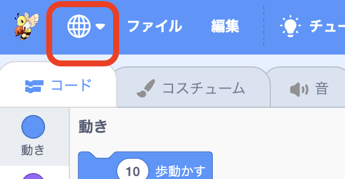
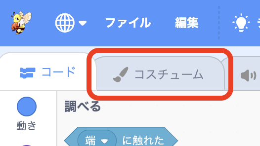
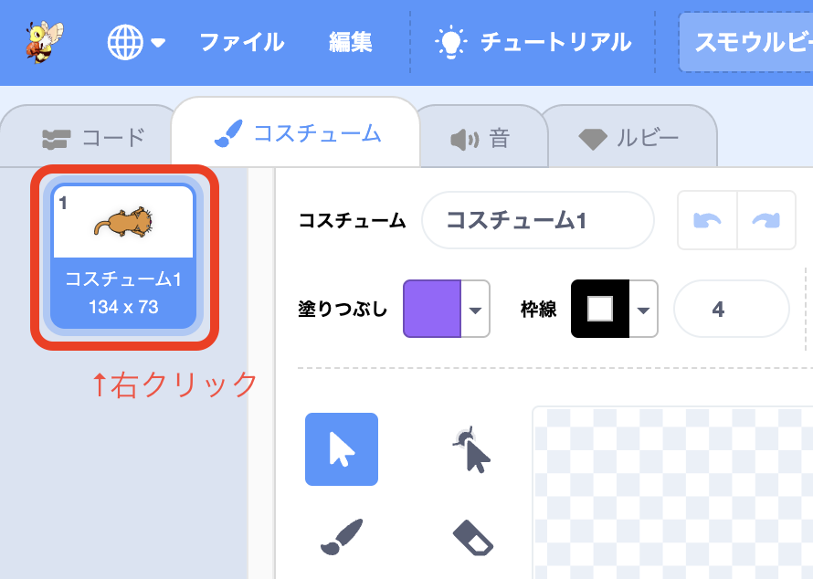
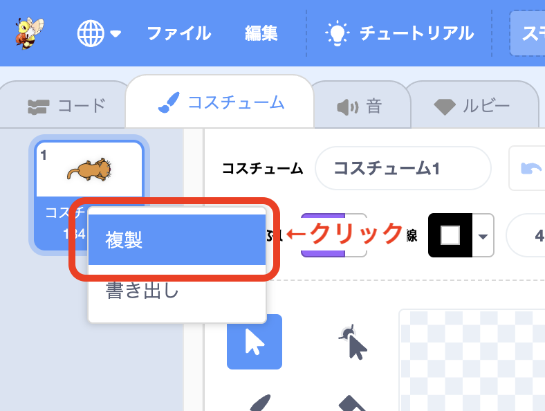
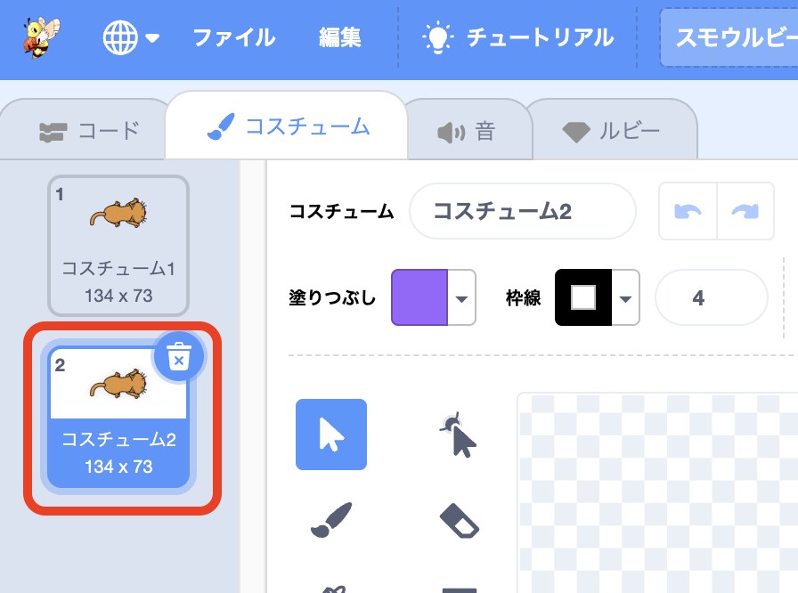
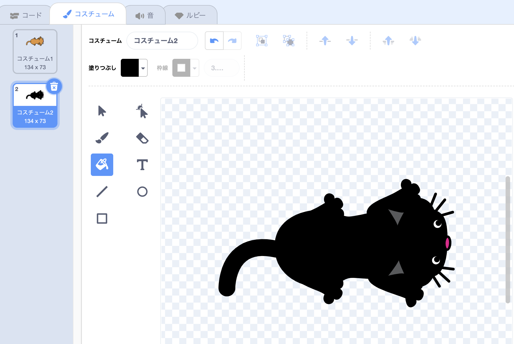
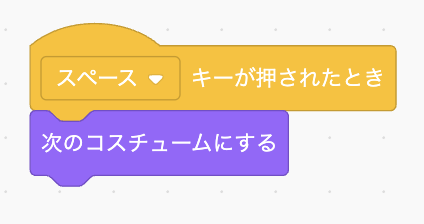
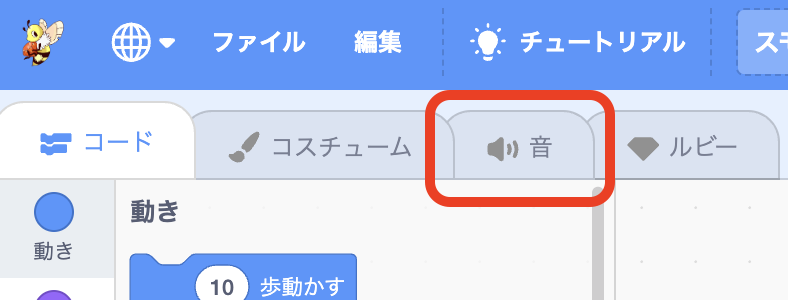
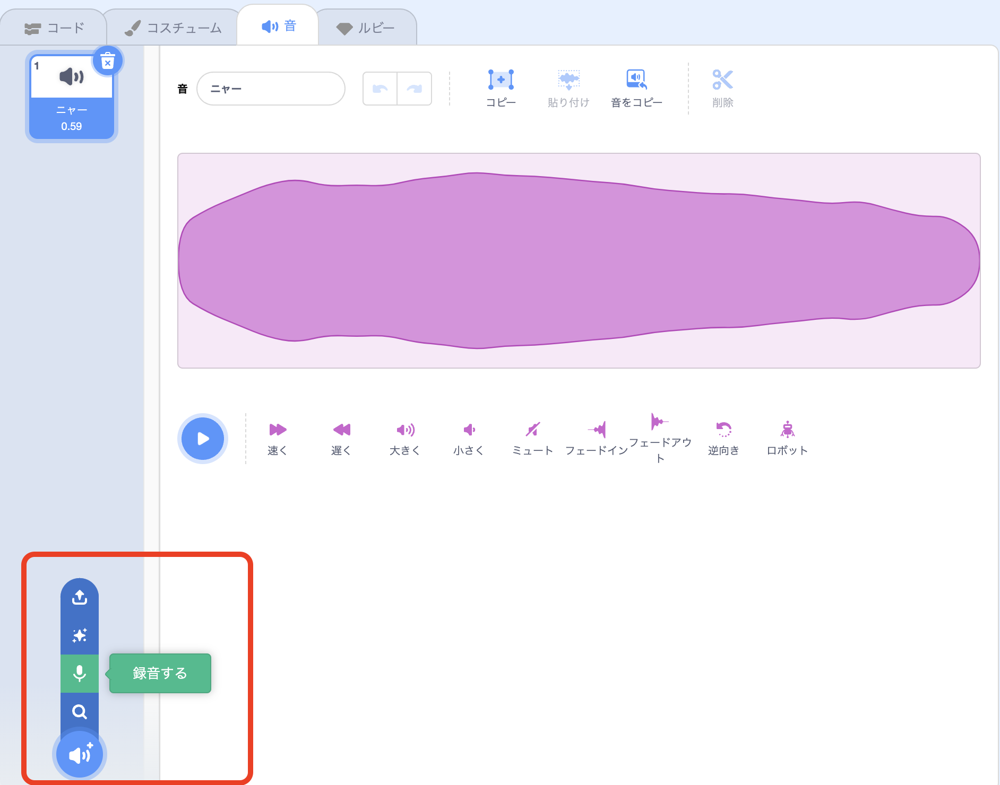

# <ruby>秋鹿学<rt>あいかまな</rt></ruby>びラボ プログラミング<ruby>教室<rt>きょうしつ</rt></ruby> <ruby>初級<rt>しょきゅう</rt></ruby>テキスト

## <ruby>準備<rt>じゅんび</rt></ruby>

- ブラウザアプリを<ruby>起動<rt>きどう</rt></ruby>します

  

- アドレスバーに「**smalruby.app**」と<ruby>入力<rt>にゅうりょく</rt></ruby>して<ruby>Enter<rt>エンター</rt></ruby>キーを<ruby>押<rt>お</rt></ruby>します

  

- スモウルビーのページが<ruby>開<rt>ひら</rt></ruby>きます

  

## スモウルビーの<ruby>画面<rt>がめん</rt></ruby>の<ruby>説明<rt>せつめい</rt></ruby>

### **1. ブロックパレット**

ブロックパレットには、さまざまな<ruby>種類<rt>しゅるい</rt></ruby>のブロック（プログラムの<ruby>部品<rt>ぶひん</rt></ruby>）があります。

ブロックパレットからブロックを<ruby>選<rt>えら</rt></ruby>んで、スクリプトエリアに<ruby>並<rt>なら</rt></ruby>べると、プログラムを<ruby>作<rt>つく</rt></ruby>ることができます。

### **2. スクリプトエリア**

スクリプトエリアにブロックパレットのブロックを<ruby>並<rt>なら</rt></ruby>べます。

スクリプトとは<ruby>台本<rt>だいほん</rt></ruby>のことです。<ruby>台本<rt>だいほん</rt></ruby>のとおりにスプライト（キャラクター）を<ruby>動<rt>うご</rt></ruby>かすことができます。

### **3. スプライトとステージ**

スプライトとはプログラムで<ruby>動<rt>うご</rt></ruby>くキャラクターのことです。ステージの<ruby>中<rt>なか</rt></ruby>で<ruby>動<rt>うご</rt></ruby>いたりしゃべったりします。

ステージはスプライトが<ruby>動<rt>うご</rt></ruby>く<ruby>舞台<rt>ぶたい</rt></ruby>のことです。いくつものスプライトを<ruby>表示<rt>ひょうじ</rt></ruby>したり、<ruby>動<rt>うご</rt></ruby>かすことができます。

プログラムはスプライトごとに<ruby>作<rt>つく</rt></ruby>れます。

 このネコなどのキャラクターを「**スプライト**」とよびます。

### **4. スプライトリストと<ruby>背景選択<rt>はいけいせんたく</rt></ruby>**

スプライトはネコのほかにもたくさんあります。もちろん<ruby>自分<rt>じぶん</rt></ruby>で<ruby>作<rt>つく</rt></ruby>ることもできます。  
スプライトの<ruby>右下<rt>みぎした</rt></ruby>のアイコンをクリックしてみましょう。

ステージの<ruby>背景<rt>はいけい</rt></ruby>も<ruby>選<rt>えら</rt></ruby>ぶことができます。<ruby>自分<rt>じぶん</rt></ruby>で<ruby>作<rt>つく</rt></ruby>ることもできます。  
お<ruby>気<rt>き</rt></ruby>に<ruby>入<rt>い</rt></ruby>りの<ruby>背景<rt>はいけい</rt></ruby>を<ruby>選<rt>えら</rt></ruby>んでみましょう。

> もしスモウルビーで<ruby>表示<rt>ひょうじ</rt></ruby>されている<ruby>漢字<rt>かんじ</rt></ruby>が<ruby>難<rt>むず</rt></ruby>しい<ruby>場合<rt>ばあい</rt></ruby>は、<ruby>左上<rt>ひだりうえ</rt></ruby>にある  を<ruby>押<rt>お</rt></ruby>して「にほんご」を<ruby>選<rt>えら</rt></ruby>ぶとすべてひらがなになります。  
> 

## かんたんなプログラムを<ruby>作<rt>つく</rt></ruby>ってみよう

### 1. スプライトを 10 <ruby>歩動<rt>ぽうご</rt></ruby>かす

- <ruby>黄色<rt>きいろ</rt></ruby>の「イベント」にある「<ruby>緑<rt>みどり</rt></ruby>の<ruby>旗<rt>はた</rt></ruby>が<ruby>押<rt>お</rt></ruby>されたとき」と  
  <ruby>青色<rt>あおいろ</rt></ruby>の「<ruby>動<rt>うご</rt></ruby>き」にある「10 <ruby>歩動<rt>ぽうご</rt></ruby>かす」をスクリプトエリアに<ruby>置<rt>お</rt></ruby>いてみましょう
- <ruby>旗<rt>はた</rt></ruby>をクリックするとスプライトが 10 <ruby>歩動<rt>ぽうご</rt></ruby>きます

  

### 2. キーボードでスプライトを<ruby>動<rt>うご</rt></ruby>かす

- <ruby>黄色<rt>きいろ</rt></ruby>の「イベント」にある「スペースキーが<ruby>押<rt>お</rt></ruby>されたとき」と  
  <ruby>青色<rt>あおいろ</rt></ruby>の「<ruby>動<rt>うご</rt></ruby>き」にある「15 <ruby>度回<rt>どまわ</rt></ruby>す」をスクリプトエリアに<ruby>置<rt>お</rt></ruby>いてみましょう
- スペースキーを<ruby>押<rt>お</rt></ruby>すとスプライトが<ruby>少<rt>すこ</rt></ruby>しずつ<ruby>回<rt>まわ</rt></ruby>ります

  

> ひとこと  
> スペースキー<ruby>以外<rt>いがい</rt></ruby>のボタンに<ruby>変<rt>か</rt></ruby>えたり、10 <ruby>歩<rt>ぽ</rt></ruby>や 15 <ruby>度<rt>ど</rt></ruby>の<ruby>数字<rt>すうじ</rt></ruby>は<ruby>好<rt>す</rt></ruby>きな数に変えることができます。  
> いろいろ試してみましょう。

### 3. <ruby>繰<rt>く</rt></ruby>り<ruby>返<rt>かえ</rt></ruby>し（<ruby>反復<rt>はんぷく</rt></ruby>）

- オレンジ<ruby>色<rt>いろ</rt></ruby>の「<ruby>制御<rt>せいぎょ</rt></ruby>」にある「ずっと」をつなげると、「ずっと」に<ruby>挟<rt>はさ</rt></ruby>まれたブロックの<ruby>命令<rt>めいれい</rt></ruby>をずっと<ruby>繰<rt>く</rt></ruby>り<ruby>返<rt>かえ</rt></ruby>します
- いろいろなブロックを<ruby>挟<rt>はさ</rt></ruby>んで<ruby>試<rt>ため</rt></ruby>してみましょう

- ↓ この<ruby>場合<rt>ばあい</rt></ruby>は「10<ruby>歩動<rt>ぽうご</rt></ruby>かす」を<ruby>挟<rt>はさ</rt></ruby>んでいるから、ずっと<ruby>前<rt>まえ</rt></ruby>に<ruby>進<rt>すす</rt></ruby>み<ruby>続<rt>つづ</rt></ruby>けます

  

### 4. もし ○○ なら（<ruby>条件分岐<rt>じょうけんぶんき</rt></ruby>）

- オレンジ<ruby>色<rt>いろ</rt></ruby>の「<ruby>制御<rt>せいぎょ</rt></ruby>」にある「もし」をつなげると、「もし〇〇なら ×× する」という<ruby>命令<rt>めいれい</rt></ruby>を<ruby>使<rt>つか</rt></ruby>えます
- ○○ に「どういうときか」、×× に「やりたいこと」をあてはめましょう
- ↓ この<ruby>場合<rt>ばあい</rt></ruby>はずっと 10 <ruby>歩動<rt>ぽうご</rt></ruby>き<ruby>続<rt>つづ</rt></ruby>けて、スプライトが<ruby>端<rt>はし</rt></ruby>まで<ruby>行<rt>い</rt></ruby>ったら<ruby>向<rt>む</rt></ruby>きを<ruby>変<rt>か</rt></ruby>えて<ruby>進<rt>すす</rt></ruby>むようにしています

  

- <ruby>水色<rt>みずいろ</rt></ruby>の「<ruby>調<rt>しら</rt></ruby>べる」には「もし」の<ruby>条件<rt>じょうけん</rt></ruby>に<ruby>使<rt>つか</rt></ruby>えるブロックがたくさんあります。いろいろ<ruby>試<rt>ため</rt></ruby>してみましょう

  

> ひとこと  
> ゲームのプログラムなどにもよく<ruby>使<rt>つか</rt></ruby>われていて、たとえば「もしパンチがあたったらたおれる」とか、「<ruby>矢印<rt>やじるし</rt></ruby>のボタンが<ruby>押<rt>お</rt></ruby>されている<ruby>間<rt>あいだ</rt></ruby>、ずっと<ruby>前<rt>まえ</rt></ruby>に<ruby>進<rt>すす</rt></ruby>むといった<ruby>使<rt>つか</rt></ruby>われ<ruby>方<rt>かた</rt></ruby>をしています。

### 5. スプライトの<ruby>見<rt>み</rt></ruby>た<ruby>目<rt>め</rt></ruby>を<ruby>変<rt>か</rt></ruby>えてみよう

- <ruby>見<rt>み</rt></ruby>た<ruby>目<rt>め</rt></ruby>を<ruby>変<rt>か</rt></ruby>えるためには「**コスチューム**」を<ruby>使<rt>つか</rt></ruby>います

- ブロックパレットの<ruby>上<rt>うえ</rt></ruby>にある「コスチューム」をクリックしましょう

  

- <ruby>今<rt>いま</rt></ruby>あるコスチュームを<ruby>右<rt>みぎ</rt></ruby>クリックして「<ruby>複製<rt>ふくせい</rt></ruby>」をクリックしましょう  
  (タッチパネルの<ruby>場合<rt>ばあい</rt></ruby>は<ruby>長押<rt>ながお</rt></ruby>しで「<ruby>複製<rt>ふくせい</rt></ruby>」が<ruby>出<rt>で</rt></ruby>てきます)

  
  

- <ruby>新<rt>あた</rt></ruby>しいコスチュームが<ruby>増<rt>ふ</rt></ruby>えるので、<ruby>自由<rt>じゆう</rt></ruby>にコスチュームを<ruby>描<rt>か</rt></ruby>いてみましょう

  

- たとえばこのように<ruby>黒猫<rt>くろねこ</rt></ruby>のコスチュームを<ruby>作<rt>つく</rt></ruby>ってみます

  

- オレンジ<ruby>色<rt>いろ</rt></ruby>の「<ruby>制御<rt>せいぎょ</rt></ruby>」にある「スペースキーが<ruby>押<rt>お</rt></ruby>されたとき」と、むらさき<ruby>色<rt>いろ</rt></ruby>の「<ruby>見<rt>み</rt></ruby>た<ruby>目<rt>め</rt></ruby>」にある「<ruby>次<rt>つぎ</rt></ruby>のコスチュームにする」を<ruby>組<rt>く</rt></ruby>み<ruby>合<rt>あ</rt></ruby>わせてみましょう

  
スペースキーを<ruby>押<rt>お</rt></ruby>すたびにコスチュームが<ruby>変<rt>か</rt></ruby>わります。

> ひとこと  
> たとえば、スプラトゥーンでは「ZL ボタンを<ruby>押<rt>お</rt></ruby>しているあいだ、イカのコスチュームに<ruby>変<rt>か</rt></ruby>える」という<ruby>使<rt>つか</rt></ruby>い<ruby>方<rt>かた</rt></ruby>をしています。

### 6. <ruby>音<rt>おと</rt></ruby>を<ruby>作<rt>つく</rt></ruby>ったり<ruby>変<rt>か</rt></ruby>えたりしてみよう

- ブロックパレットの<ruby>上<rt>うえ</rt></ruby>にある「<ruby>音<rt>おと</rt></ruby>」タブをクリックしましょう

  

- <ruby>左下<rt>ひだりした</rt></ruby>のスピーカーのアイコンから<ruby>音<rt>おと</rt></ruby>が<ruby>選<rt>えら</rt></ruby>べます

  

- コスチュームと<ruby>同<rt>おな</rt></ruby>じように、<ruby>今<rt>いま</rt></ruby>ある<ruby>音<rt>おと</rt></ruby>を<ruby>右<rt>みぎ</rt></ruby>クリックして<ruby>複製<rt>ふくせい</rt></ruby>したり、<ruby>自分<rt>じぶん</rt></ruby>で<ruby>録音<rt>ろくおん</rt></ruby>した<ruby>声<rt>こえ</rt></ruby>を<ruby>入<rt>い</rt></ruby>れることもできます

> ひとこと  
> たとえば、ゲームで<ruby>宝箱<rt>たからばこ</rt></ruby>を<ruby>見<rt>み</rt></ruby>つけたときや、<ruby>敵<rt>てき</rt></ruby>を<ruby>倒<rt>たお</rt></ruby>したときに<ruby>音<rt>おと</rt></ruby>を<ruby>流<rt>なが</rt></ruby>すと<ruby>楽<rt>たの</rt></ruby>しくなりますね

**参考図書**

小学生から楽しむきらきら Ruby プログラミング  
高尾宏治・藤村健吾 著、 まつもとゆきひろ 監修
