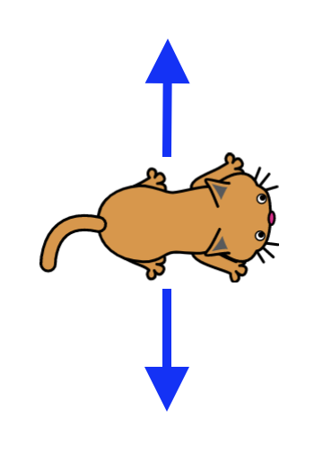
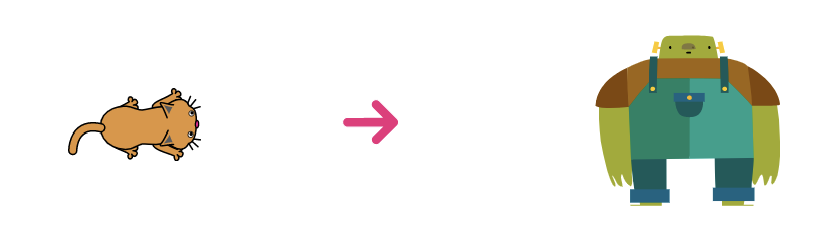
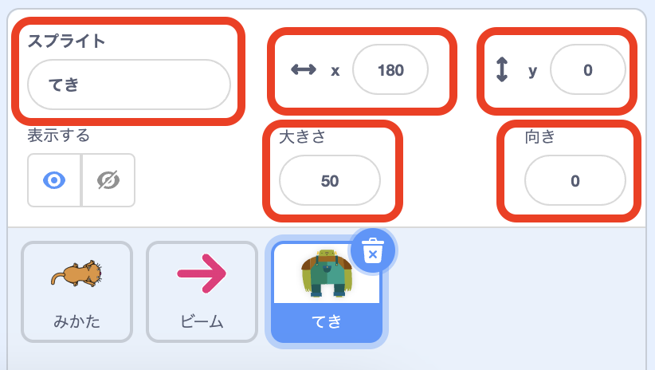
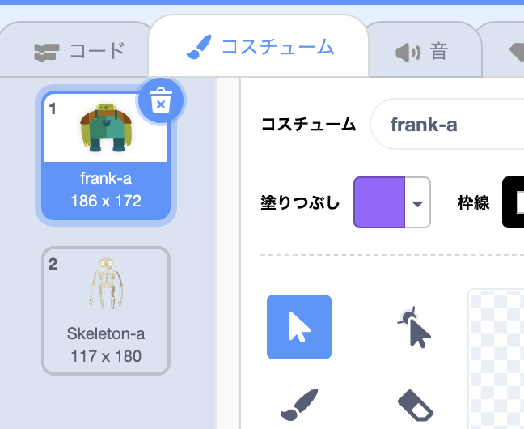
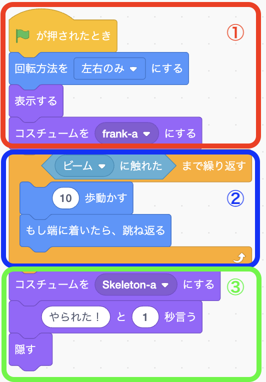

# <ruby>秋鹿学<rt>あいかまな</rt></ruby>びラボ プログラミング<ruby>教室<rt>きょうしつ</rt></ruby> ステップアップ

## シューティングゲームを<ruby>作<rt>つく</rt></ruby>ってみよう

### 1. シューティングゲームの<ruby>説明<rt>せつめい</rt></ruby>

- みどりの<ruby>旗<rt>はた</rt></ruby>が<ruby>押<rt>お</rt></ruby>されたらゲームスタート

  

- キーボードの<ruby>矢印<rt>やじるし</rt></ruby>キーでネコが<ruby>上下<rt>じょうげ</rt></ruby>に<ruby>動<rt>うご</rt></ruby>かせるようにします

  

- キーボードのスペースキーを<ruby>押<rt>お</rt></ruby>したらネコが<ruby>右<rt>みぎ</rt></ruby>にビームを<ruby>出<rt>だ</rt></ruby>します

   <ruby>赤<rt>あか</rt></ruby>の<ruby>矢印<rt>やじるし</rt></ruby>がビーム！

- <ruby>敵<rt>てき</rt></ruby>は<ruby>右端<rt>みぎはし</rt></ruby>で<ruby>上下<rt>じょうげ</rt></ruby>に<ruby>動<rt>うご</rt></ruby>きます

  

- <ruby>敵<rt>てき</rt></ruby>にビームが<ruby>当<rt>あ</rt></ruby>たると「やられた」と<ruby>言<rt>い</rt></ruby>って<ruby>消<rt>き</rt></ruby>えます

   がいこつになって<ruby>消<rt>き</rt></ruby>える

### 2. <ruby>準備<rt>じゅんび</rt></ruby>

- スプライトを 3 つ<ruby>準備<rt>じゅんび</rt></ruby>します

  

- このテキストではネコ（<ruby>味方<rt>みかた</rt></ruby>）、<ruby>矢印<rt>やじるし</rt></ruby>（ビーム）、フランケンシュタイン（<ruby>敵<rt>てき</rt></ruby>）を<ruby>使<rt>つか</rt></ruby>います
- <ruby>好<rt>す</rt></ruby>きなスプライトを 3 つ<ruby>選<rt>えら</rt></ruby>んでみましょう
  - を押すとスプライトを<ruby>選<rt>えら</rt></ruby>べます
- <ruby>味方<rt>みかた</rt></ruby>、ビーム、<ruby>敵<rt>てき</rt></ruby>で<ruby>別々<rt>べつべつ</rt></ruby>にプログラムを<ruby>作<rt>つく</rt></ruby>っていきます

  

### 3. スプライトの<ruby>設定<rt>せってい</rt></ruby>

3 つのスプライトの<ruby>名前<rt>なまえ</rt></ruby>や<ruby>大<rt>おお</rt></ruby>きさなどを<ruby>設定<rt>せってい</rt></ruby>します。

- <ruby>味方<rt>みかた</rt></ruby>の<ruby>設定<rt>せってい</rt></ruby>

  

  - スプライトの<ruby>名前<rt>なまえ</rt></ruby>を「みかた」にします
  - x を「-180」にします
  - y を「0」にします
  - <ruby>大<rt>おお</rt></ruby>きさを「50」にします

- ビームの<ruby>設定<rt>せってい</rt></ruby>

  

  - スプライトの<ruby>名前<rt>なまえ</rt></ruby>を「ビーム」にします
  - x を「0」にします
  - y を「0」にします
  - <ruby>大<rt>おお</rt></ruby>きさを「50」にします

- <ruby>敵<rt>てき</rt></ruby>の<ruby>設定<rt>せってい</rt></ruby>

  

  - スプライトの<ruby>名前<rt>なまえ</rt></ruby>を「てき」にします
  - x を「180」にします
  - y を「0」にします
  - <ruby>大<rt>おお</rt></ruby>きさを「50」にします
  - <ruby>向<rt>む</rt></ruby>きを「0」にします

### 4. <ruby>味方<rt>みかた</rt></ruby>のプログラム

キーボードで<ruby>上下<rt>じょうげ</rt></ruby>に<ruby>動<rt>うご</rt></ruby>かすには、「イベント」の「〜キーが<ruby>押<rt>お</rt></ruby>されたとき」と、「<ruby>動<rt>うご</rt></ruby>き」の「y<ruby>座標<rt>ざひょう</rt></ruby>を〜ずつ<ruby>変<rt>か</rt></ruby>える」を<ruby>使<rt>つか</rt></ruby>います。

> チャレンジ
>
> y<ruby>座標<rt>ざひょう</rt></ruby>は<ruby>上下<rt>じょうげ</rt></ruby>の<ruby>方向<rt>ほうこう</rt></ruby>のことです。
>
> - 10 は<ruby>上<rt>うえ</rt></ruby>に<ruby>動<rt>うご</rt></ruby>きます
> - -10 は<ruby>下<rt>した</rt></ruby>に<ruby>動<rt>うご</rt></ruby>きます
>
> <ruby>数字<rt>すうじ</rt></ruby>を<ruby>変<rt>か</rt></ruby>えてみたらどうなるかやってみましょう！

### 5. ビームのプログラム

ゲームをスタートしたときはビームが<ruby>見<rt>み</rt></ruby>えないようにします。

「<ruby>緑<rt>みどり</rt></ruby>の<ruby>旗<rt>はた</rt></ruby>が<ruby>押<rt>お</rt></ruby>されたとき」に「<ruby>隠<rt>かく</rt></ruby>す」のブロックを<ruby>組<rt>く</rt></ruby>み<ruby>合<rt>あ</rt></ruby>わせます。  
「<ruby>隠<rt>かく</rt></ruby>す」は「<ruby>見<rt>み</rt></ruby>た<ruby>目<rt>め</rt></ruby>」のところにあるので<ruby>探<rt>さが</rt></ruby>してみましょう。

キーボードのスペースキーを<ruby>押<rt>お</rt></ruby>したら、<ruby>味方<rt>みかた</rt></ruby>から<ruby>右<rt>みぎ</rt></ruby>にビームが<ruby>出<rt>で</rt></ruby>るようにします。

1. <ruby>赤枠<rt>あかわく</rt></ruby>の<ruby>部分<rt>ぶぶん</rt></ruby>で、スペースキーを<ruby>押<rt>お</rt></ruby>したらビームが<ruby>味方<rt>みかた</rt></ruby>から<ruby>出<rt>で</rt></ruby>てくる<ruby>仕組<rt>しく</rt></ruby>みを<ruby>作<rt>つく</rt></ruby>っています
2. <ruby>青枠<rt>あおわく</rt></ruby>の<ruby>部分<rt>ぶぶん</rt></ruby>でビームが<ruby>味方<rt>みかた</rt></ruby>から<ruby>出<rt>で</rt></ruby>たあとに<ruby>右<rt>みぎ</rt></ruby>に<ruby>動<rt>うご</rt></ruby>いていく<ruby>仕組<rt>しく</rt></ruby>みを<ruby>作<rt>つく</rt></ruby>っています

「<ruby>表示<rt>ひょうじ</rt></ruby>する」は「<ruby>隠<rt>かく</rt></ruby>す」と<ruby>同<rt>おな</rt></ruby>じで「<ruby>見<rt>み</rt></ruby>た<ruby>目<rt>め</rt></ruby>」のところにあります。  
この 2 つを<ruby>組<rt>く</rt></ruby>み<ruby>合<rt>あ</rt></ruby>わせてビームが<ruby>出<rt>で</rt></ruby>たり<ruby>消<rt>き</rt></ruby>えたりするようになっています。

> チャレンジ
>
> x<ruby>座標<rt>ざひょう</rt></ruby>は<ruby>左右方向<rt>さゆうほうこう</rt></ruby>のことです。  
> <ruby>数字<rt>すうじ</rt></ruby>を<ruby>変<rt>か</rt></ruby>えてみるとビームはどうなるでしょうか？

### 5. <ruby>敵<rt>てき</rt></ruby>のプログラム

- コスチュームを 2 つ<ruby>用意<rt>ようい</rt></ruby>します

  1. <ruby>敵<rt>てき</rt></ruby>が<ruby>上下<rt>じょうげ</rt></ruby>に<ruby>動<rt>うご</rt></ruby>いているときの<ruby>見<rt>み</rt></ruby>た<ruby>目<rt>め</rt></ruby>
  2. <ruby>敵<rt>てき</rt></ruby>がビームにあたったときの<ruby>見<rt>み</rt></ruby>た<ruby>目<rt>め</rt></ruby>

  

> チャレンジ
>
> <ruby>敵<rt>てき</rt></ruby>のコスチュームを<ruby>好<rt>す</rt></ruby>きな<ruby>組<rt>く</rt></ruby>み<ruby>合<rt>あ</rt></ruby>わせに<ruby>変<rt>か</rt></ruby>えてみよう

**①ゲームをスタートしたら<ruby>敵<rt>てき</rt></ruby>が<ruby>出<rt>で</rt></ruby>てくる**

「<ruby>表示<rt>ひょうじ</rt></ruby>する」と「コスチュームを〜にする」を<ruby>組<rt>く</rt></ruby>み<ruby>合<rt>あ</rt></ruby>わせて<ruby>敵<rt>てき</rt></ruby>が<ruby>出<rt>で</rt></ruby>てくるようにします。

**②ビームに<ruby>当<rt>あ</rt></ruby>たるまで<ruby>上下<rt>じょうげ</rt></ruby>に<ruby>動<rt>うご</rt></ruby>く**

「ずっと」と「もし」の<ruby>組<rt>く</rt></ruby>み<ruby>合<rt>あ</rt></ruby>わせで<ruby>敵<rt>てき</rt></ruby>を<ruby>上下<rt>じょうげ</rt></ruby>に<ruby>動<rt>うご</rt></ruby>かします。  
「イベント」にある「〜まで<ruby>繰<rt>く</rt></ruby>り<ruby>返<rt>かえ</rt></ruby>す」と「<ruby>調<rt>しら</rt></ruby>べる」にある「〜に<ruby>触<rt>ふ</rt></ruby>れた」を<ruby>組<rt>く</rt></ruby>み<ruby>合<rt>あ</rt></ruby>わせると、ビームに<ruby>当<rt>あ</rt></ruby>たるまでの<ruby>敵<rt>てき</rt></ruby>の<ruby>動<rt>うご</rt></ruby>きが<ruby>作<rt>つく</rt></ruby>れます。

**③ビームに<ruby>当<rt>あ</rt></ruby>たったら「やられた！」と<ruby>言<rt>い</rt></ruby>って<ruby>消<rt>き</rt></ruby>える**

コスチュームを<ruby>変<rt>か</rt></ruby>えた<ruby>後<rt>あと</rt></ruby>に、<ruby>敵<rt>てき</rt></ruby>に「やられた！」と<ruby>言<rt>い</rt></ruby>わせて「<ruby>隠<rt>かく</rt></ruby>す」で<ruby>消<rt>け</rt></ruby>しています。

 

**参考図書**  
小学生から楽しむきらきら Ruby プログラミング  
高尾宏治・藤村健吾 著、 まつもとゆきひろ 監修
