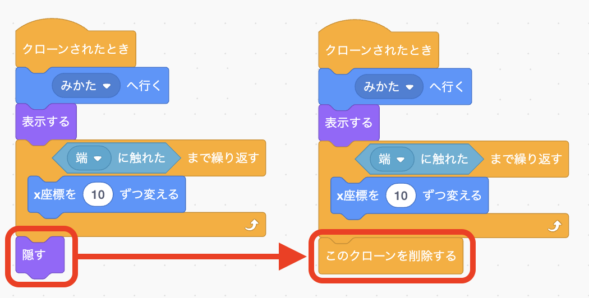

# <ruby>秋鹿学<rt>あいかまな</rt></ruby>びラボ プログラミング<ruby>教室<rt>きょうしつ</rt></ruby> ステップアップ 2

## シューティングゲームをバージョンアップしよう

<ruby>前回作<rt>ぜんかいつく</rt></ruby>ったシューティングゲームを、もっと<ruby>面白<rt>おもしろ</rt></ruby>くなるようにプログラムを<ruby>追加<rt>ついか</rt></ruby>していきましょう。

### 1. ビームをたくさん<ruby>出<rt>だ</rt></ruby>せるようにしよう

<ruby>前回<rt>ぜんかい</rt></ruby>のプログラムではスペースキーを<ruby>押<rt>お</rt></ruby>してビームを<ruby>出<rt>だ</rt></ruby>したあと、またすぐにスペースキーを<ruby>押<rt>お</rt></ruby>してもビームが<ruby>出<rt>で</rt></ruby>ません。

スペースキーを<ruby>押<rt>お</rt></ruby>すたびにビームが<ruby>出<rt>で</rt></ruby>るようにプログラムを<ruby>追加<rt>ついか</rt></ruby>してみましょう。

<ruby>同<rt>お</rt></ruby>じものをたくさん<ruby>出<rt>だ</rt></ruby>すには「クローン」を<ruby>使<rt>つか</rt></ruby>います。

- 「ビーム」の「スペースキーが<ruby>押<rt>お</rt></ruby>されたとき」のプログラムを、「クローンされたとき」に<ruby>変<rt>か</rt></ruby>えます

  

- 「スペースキーが<ruby>押<rt>お</rt></ruby>されたとき」は「<ruby>自分自身<rt>じぶんじしん</rt></ruby>のクローンを<ruby>作<rt>つく</rt></ruby>る」だけにします

  

- クローンはたくさん<ruby>作<rt>つく</rt></ruby>りすぎるとプログラムの<ruby>動作<rt>どうさ</rt></ruby>が<ruby>遅<rt>おそ</rt></ruby>くなるので、ビームが<ruby>端<rt>はし</rt></ruby>に<ruby>触<rt>ふ</rt></ruby>れたらクローンを<ruby>削除<rt>さくじょ</rt></ruby>するようにします

  

- <ruby>緑<rt>みどり</rt></ruby>の<ruby>旗<rt>はた</rt></ruby>を<ruby>押<rt>お</rt></ruby>してプログラムを<ruby>動<rt>うご</rt></ruby>かしてみましょう。スペースキーを<ruby>押<rt>お</rt></ruby>した<ruby>数<rt>かず</rt></ruby>だけビームが<ruby>出<rt>で</rt></ruby>ますね

  

### 2. <ruby>敵<rt>てき</rt></ruby>も<ruby>増<rt>ふ</rt></ruby>やしてみよう

「クローン」を<ruby>使<rt>つか</rt></ruby>うと<ruby>敵<rt>てき</rt></ruby>もたくさん<ruby>出<rt>だ</rt></ruby>すことができます。

- 「てき」の「<ruby>緑<rt>みどり</rt></ruby>の<ruby>旗<rt>はた</rt></ruby>が<ruby>押<rt>お</rt></ruby>されたとき」のプログラムの「<ruby>表示<rt>ひょうじ</rt></ruby>する」から<ruby>下<rt>した</rt></ruby>の<ruby>部分<rt>ぶぶん</rt></ruby>を「クローンされたとき」に<ruby>移動<rt>いどう</rt></ruby>します
- ビームのときのように「<ruby>隠<rt>かく</rt></ruby>す」を「このクローンを<ruby>削除<rt>さくじょ</rt></ruby>する」に<ruby>変<rt>か</rt></ruby>えておきましょう

  

- 「<ruby>緑<rt>みどり</rt></ruby>の<ruby>旗<rt>はた</rt></ruby>が<ruby>押<rt>お</rt></ruby>されたとき」のプログラムを<ruby>以下<rt>いか</rt></ruby>のように<ruby>変<rt>か</rt></ruby>えてみましょう

  

- このプログラムでは 10<ruby>回<rt>かい</rt></ruby>クローンが<ruby>作<rt>つく</rt></ruby>られますが、<ruby>同<rt>おな</rt></ruby>じ<ruby>場所<rt>ばしょ</rt></ruby>に<ruby>続<rt>つづ</rt></ruby>けてクローンを<ruby>作<rt>つく</rt></ruby>るため<ruby>全部<rt>ぜんぶ</rt></ruby>くっついて<ruby>動<rt>うご</rt></ruby>いてしまいます

  

- <ruby>少<rt>すこ</rt></ruby>し<ruby>間<rt>ま</rt></ruby>をおいて<ruby>新<rt>あた</rt></ruby>しい<ruby>敵<rt>てき</rt></ruby>が<ruby>出<rt>で</rt></ruby>てくるように、「2<ruby>秒待<rt>びょうま</rt></ruby>つ」を「<ruby>自分自身<rt>じぶんじしん</rt></ruby>のクローンを<ruby>作<rt>つく</rt></ruby>る」の<ruby>前<rt>まえ</rt></ruby>に<ruby>入<rt>い</rt></ruby>れます

  

- <ruby>次<rt>つぎ</rt></ruby>に「クローンされたとき」のプログラムの<ruby>最初<rt>さいしょ</rt></ruby>に「どこかの<ruby>場所<rt>ばしょ</rt></ruby>へ<ruby>行<rt>い</rt></ruby>く」と「<ruby>X<rt>エックス</rt></ruby><ruby>座標<rt>ざひょう</rt></ruby>を 180 にする」を<ruby>入<rt>い</rt></ruby>れます

  - 「どこかの<ruby>場所<rt>ばしょ</rt></ruby>へ<ruby>行<rt>い</rt></ruby>く」で<ruby>出<rt>で</rt></ruby>てくる<ruby>場所<rt>ばしょ</rt></ruby>を<ruby>変<rt>か</rt></ruby>えます
  - 「<ruby>X<rt>エックス</rt></ruby><ruby>座標<rt>ざひょう</rt></ruby>を 180 にする」で<ruby>横<rt>よこ</rt></ruby>の<ruby>位置<rt>いち</rt></ruby>は<ruby>右端<rt>みぎはし</rt></ruby>にします

  

- 「<ruby>X<rt>エックス</rt></ruby><ruby>座標<rt>ざひょう</rt></ruby>を −2 ずつ<ruby>変<rt>か</rt></ruby>える」を<ruby>使<rt>つか</rt></ruby>って<ruby>敵<rt>てき</rt></ruby>が<ruby>少<rt>すこ</rt></ruby>しずつ<ruby>前<rt>まえ</rt></ruby>に<ruby>進<rt>すす</rt></ruby>むようにしてみましょう

  

- <ruby>敵<rt>てき</rt></ruby>が 2<ruby>秒<rt>びょう</rt></ruby>おきにいろいろな<ruby>場所<rt>ばしょ</rt></ruby>から<ruby>出<rt>で</rt></ruby>てくるようになりました

  

### 3. <ruby>敵<rt>てき</rt></ruby>に<ruby>当<rt>あ</rt></ruby>たったらゲームオーバになるようにしよう

- 「みかた」のプログラムに<ruby>追加<rt>ついか</rt></ruby>して「てき」に<ruby>当<rt>あ</rt></ruby>たったらゲームが<ruby>終<rt>お</rt></ruby>わるようにしてみましょう

  - 「ずっと」と「もし」を<ruby>使<rt>つか</rt></ruby>ってゲーム<ruby>中<rt>ちゅう</rt></ruby>ずっと<ruby>敵<rt>てき</rt></ruby>に<ruby>当<rt>あ</rt></ruby>たったかどうか<ruby>調<rt>しら</rt></ruby>べます
  - 「すべてを<ruby>止<rt>と</rt></ruby>める」を<ruby>使<rt>つか</rt></ruby>うとすべてプログラムが<ruby>終了<rt>しゅうりょう</rt></ruby>します

  

 

**参考図書**  
小学生から楽しむきらきら Ruby プログラミング (高尾宏治・藤村健吾 著、 まつもとゆきひろ 監修)
