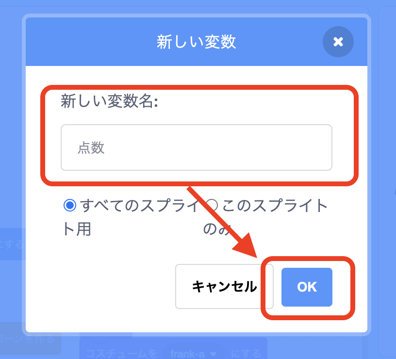

# <ruby>秋鹿学<rt>あいかまな</rt></ruby>びラボ プログラミング<ruby>教室<rt>きょうしつ</rt></ruby> ステップアップ 3

## <ruby>変数<rt>へんすう</rt></ruby>とメッセージの<ruby>使<rt>つか</rt></ruby>い<ruby>方<rt>かた</rt></ruby>を<ruby>覚<rt>おぼ</rt></ruby>えよう

### 1. 点数を表示してみよう

「<ruby>変数<rt>へんすう</rt></ruby>」というものを<ruby>使<rt>つか</rt></ruby>って、<ruby>前回<rt>ぜんかい</rt></ruby>までに<ruby>作<rt>つく</rt></ruby>ったシューティングゲームで<ruby>点数<rt>てんすう</rt></ruby>を<ruby>計算<rt>けいさん</rt></ruby>して<ruby>表示<rt>ひょうじ</rt></ruby>してみましょう。

「<ruby>変数<rt>へんすう</rt></ruby>」とは、<ruby>文字<rt>もじ</rt></ruby>や<ruby>数値<rt>すうち</rt></ruby>を<ruby>入<rt>い</rt></ruby>れておける<ruby>入<rt>い</rt></ruby>れ<ruby>物<rt>もの</rt></ruby>です。

- コードの「<ruby>変数<rt>へんすう</rt></ruby>」にある「<ruby>変数<rt>へんすう</rt></ruby>を<ruby>作<rt>つく</rt></ruby>る」をクリックします

  

- 「<ruby>新<rt>あたら</rt></ruby>しい<ruby>変数名<rt>変数名</rt></ruby>」のところに「<ruby>点数<rt>てんすう</rt></ruby>」という<ruby>名前<rt>なまえ</rt></ruby>をつけてOKをクリックします

  

- <ruby>新<rt>あたら</rt></ruby>しく「<ruby>点数<rt>てんすう</rt></ruby>」という<ruby>名前<rt>なまえ</rt></ruby>の<ruby>変数<rt>へんすう</rt></ruby>ができました

  

- ステージの<ruby>左上<rt>ひだりうえ</rt></ruby>にも「<ruby>点数<rt>てんすう</rt></ruby>」が<ruby>表示<rt>ひょうじ</rt></ruby>されています

  

- <ruby>敵<rt>てき</rt></ruby>のプログラムを<ruby>書<rt>か</rt></ruby>きかえて、ビームが<ruby>敵<rt>てき</rt></ruby>に<ruby>当<rt>あ</rt></ruby>たったら100<ruby>点増<rt>てんふ</rt></ruby>えるようにしてみましょう

  

  - <ruby>最初<rt>さいしょ</rt></ruby>に<ruby>緑<rt>みどり</rt></ruby>の<ruby>旗<rt>はた</rt></ruby>が<ruby>押<rt>お</rt></ruby>されたときは<ruby>点数<rt>てんすう</rt></ruby>を0にします
  - <ruby>敵<rt>てき</rt></ruby>がビームに<ruby>当<rt>あ</rt></ruby>たって「やられた！」というときに<ruby>点数<rt>てんすう</rt></ruby>を100<ruby>増<rt>ふ</rt></ruby>やします

- ゲームを<ruby>動<rt>うご</rt></ruby>かしてみて、ビームが<ruby>当<rt>あ</rt></ruby>たると<ruby>点数<rt>てんすう</rt></ruby>が<ruby>増<rt>ふ</rt></ruby>えることを<ruby>確認<rt>かくにん</rt></ruby>しましょう

### 2. <ruby>味方<rt>みかた</rt></ruby>が<ruby>敵<rt>てき</rt></ruby>に<ruby>当<rt>あ</rt></ruby>たったときにゲームオーバーになるようにしよう

これまでのプログラムだと、<ruby>味方<rt>みかた</rt></ruby>が<ruby>敵<rt>てき</rt></ruby>に<ruby>当<rt>あ</rt></ruby>たっても<ruby>何<rt>なに</rt></ruby>も<ruby>起<rt>お</rt></ruby>きず、<ruby>左端<rt>ひだりはし</rt></ruby>に<ruby>敵<rt>てき</rt></ruby>がたくさんたまってしまいます。

  

<ruby>味方<rt>みかた</rt></ruby>が<ruby>敵<rt>てき</rt></ruby>に<ruby>当<rt>あ</rt></ruby>たったときは、<ruby>敵<rt>てき</rt></ruby>の<ruby>動<rt>うご</rt></ruby>きが<ruby>止<rt>と</rt></ruby>まるようにしてみましょう。

- <ruby>味方<rt>みかた</rt></ruby>のプログラムに<ruby>緑<rt>みどり</rt></ruby>の<ruby>旗<rt>はた</rt></ruby>が<ruby>押<rt>お</rt></ruby>されたときを<ruby>追加<rt>ついか</rt></ruby>して、<ruby>味方<rt>みかた</rt></ruby>がやられたときも「やられた！」と<ruby>言<rt>い</rt></ruby>うようにしましょう

  

  - コスチューム2はやられたときのコスチュームを<ruby>自由<rt>じゆう</rt></ruby>に<ruby>追加<rt>ついか</rt></ruby>してみましょう

<ruby>次<rt>つぎ</rt></ruby>に「<ruby>味方<rt>みかた</rt></ruby>に<ruby>敵<rt>てき</rt></ruby>が<ruby>当<rt>あ</rt></ruby>たったら<ruby>止<rt>と</rt></ruby>まる」ようにしたいですが、どうすればよいでしょうか？

- <ruby>試<rt>ため</rt></ruby>しに<ruby>以下<rt>いか</rt></ruby>のように、<ruby>敵<rt>てき</rt></ruby>のプログラムで<ruby>味方<rt>みかた</rt></ruby>に<ruby>当<rt>あ</rt></ruby>たったことを<ruby>調<rt>しら</rt></ruby>べて<ruby>動<rt>うご</rt></ruby>きを<ruby>止<rt>と</rt></ruby>めるとどうなるでしょう？

  

- 「すべてを<ruby>止<rt>と</rt></ruby>める」を<ruby>使<rt>つか</rt></ruby>うとプログラムが<ruby>全部止<rt>ぜんぶと</rt></ruby>まってしまうため、クローンがなくなるので<ruby>敵<rt>てき</rt></ruby>もみんな<ruby>消<rt>き</rt></ruby>えてしまいます

- では「このスクリプトを<ruby>止<rt>と</rt></ruby>める」だとどうでしょうか

  

  - 味方<rt>みかた</rt></ruby>に<ruby>当<rt>あ</rt></ruby>たった<ruby>敵<rt>てき</rt></ruby>だけが<ruby>止<rt>と</rt></ruby>まり、<ruby>他<rt>ほか</rt></ruby>の<ruby>敵<rt>てき</rt></ruby>は<ruby>動<rt>うご</rt></ruby>いたままです

このようなときに「メッセージ」というものを<ruby>使<rt>つか</rt></ruby>います。

「メッセージ」はすべてのスプライトに<ruby>対<rt>たい</rt></ruby>して、<ruby>何<rt>なに</rt></ruby>かが起きたことを知らせることができます。

- 「イベント」にある「メッセージ1を<ruby>送<rt>おく</rt></ruby>る」を、<ruby>味方<rt>みかた</rt></ruby>のプログラムで「やられた！」と<ruby>言<rt>い</rt></ruby>う<ruby>前<rt>まえ</rt></ruby>に<ruby>追加<rt>ついか</rt></ruby>します

  

- 「メッセージ１」のままだとわかりにくいので、メッセージに<ruby>名前<rt>なまえ</rt></ruby>をつけます
- 「メッセージ１」をクリックして「<ruby>新<rt>あたら</rt></ruby>しいメッセージ」をクリックします

  

- メッセージに「ゲームオーバー」という<ruby>名前<rt>なまえ</rt></ruby>をつけてOKをクリックします

  

  

- <ruby>敵<rt>てき</rt></ruby>のプログラムで「ゲームオーバーを<ruby>受<rt>う</rt></ruby>け<ruby>取<rt>と</rt></ruby>ったとき」に「スプライトの<ruby>他<rt>ほか</rt></ruby>のスクリプトを<ruby>止<rt>と</rt></ruby>める」ようにします

  

  - 「スプライトの<ruby>他<rt>ほか</rt></ruby>のスクリプトを<ruby>止<rt>と</rt></ruby>める」は、<ruby>同<rt>おな</rt></ruby>じスプライトの<ruby>中<rt>なか</rt></ruby>でこのブロックが<ruby>置<rt>お</rt></ruby>かれていない<ruby>他<rt>ほか</rt></ruby>のプログラムを<ruby>止<rt>と</rt></ruby>めます

これでゲームを<ruby>動<rt>うご</rt></ruby>かしてみましょう。<ruby>味方<rt>みかた</rt></ruby>が<ruby>敵<rt>てき</rt></ruby>に<ruby>当<rt>あ</rt></ruby>たるとすべての<ruby>敵<rt>てき</rt></ruby>の<ruby>動<rt>うご</rt></ruby>きが<ruby>止<rt>と</rt></ruby>まります。

> チャレンジ
>
> 1.<ruby>今<rt>いま</rt></ruby>のプログラムだと、<ruby>味方<rt>みかた</rt></ruby>がやられた<ruby>後<rt>あと</rt></ruby>もスペースキーを<ruby>押<rt>お</rt></ruby>すとビームが<ruby>出<rt>で</rt></ruby>てしまいます。ビームを<ruby>出<rt>だ</rt></ruby>せなくするにはどうすればよいでしょうか？
>
> 2.<ruby>背景<rt>はいけい</rt></ruby>や<ruby>音楽<rt>おんがく</rt></ruby>をつけてみましょう。ビームが<ruby>出<rt>で</rt></ruby>たときや<ruby>敵<rt>てき</rt></ruby>に<ruby>当<rt>あ</rt></ruby>たったときなどの<ruby>効果音<rt>こうかおん</rt></ruby>もつけてみましょう
>

