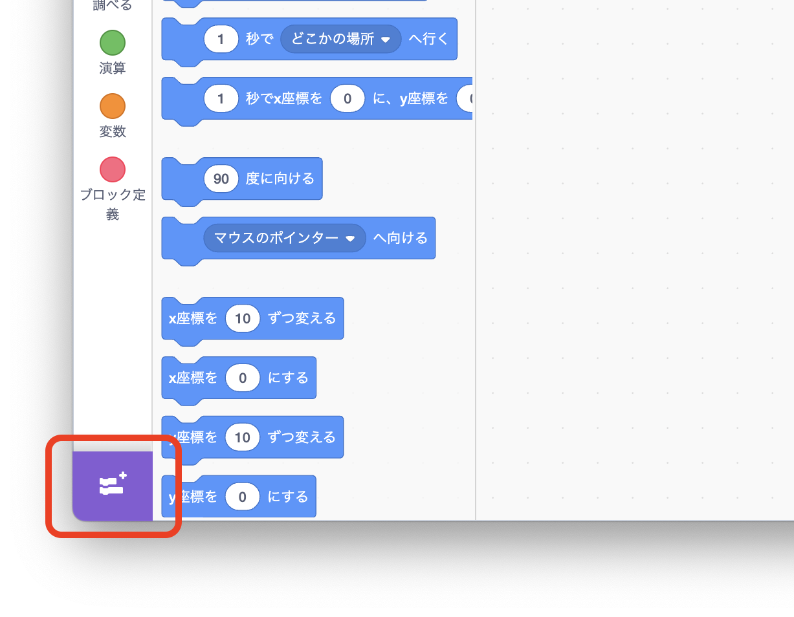
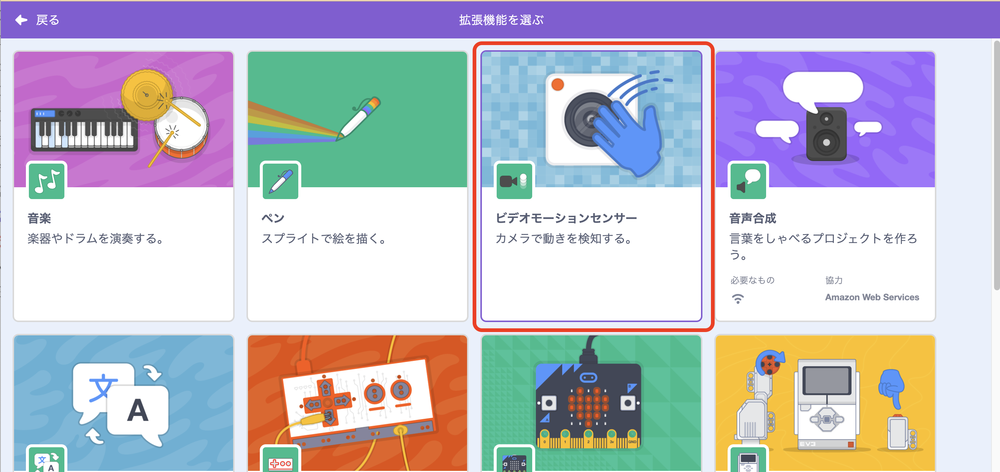
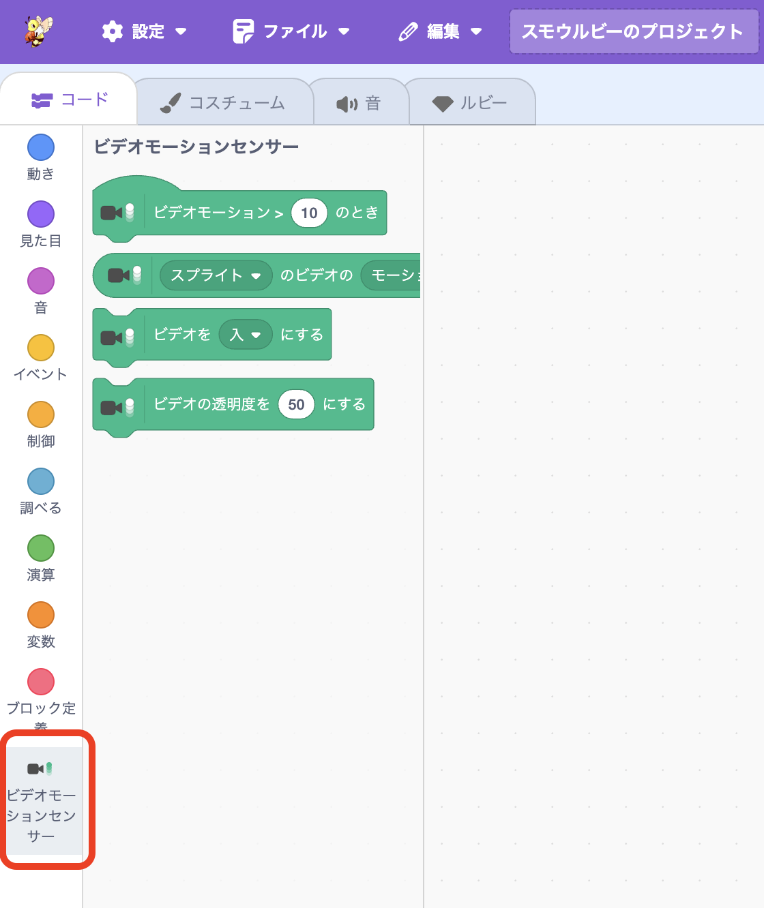
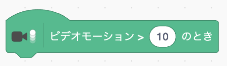
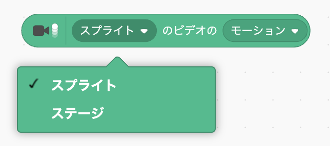
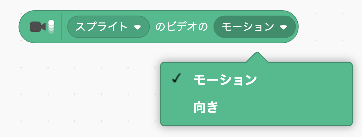
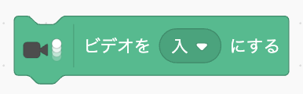
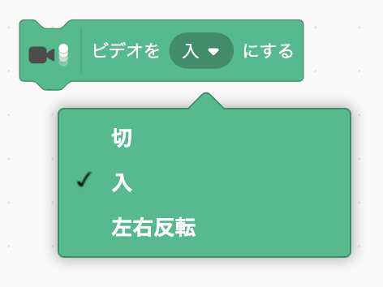
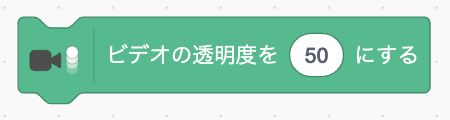

# <ruby>秋鹿学<rt>あいかまな</rt></ruby>びラボ プログラミング<ruby>教室<rt>きょうしつ</rt></ruby>

## ビデオモーションセンサーを<ruby>使<rt>つか</rt></ruby>ってみよう

<ruby>今回<rt>こんかい</rt></ruby>は「ビデオモーションセンサー」というものを<ruby>使<rt>つか</rt></ruby>ってみましょう。

ビデオモーションセンサーを<ruby>使<rt>つか</rt></ruby>うと、カメラに<ruby>映<rt>うつ</rt></ruby>ったものの<ruby>動<rt>うご</rt></ruby>きを<ruby>調<rt>しら</rt></ruby>べてプログラミングすることができます。

ビデオモーションセンサーは<ruby>拡張機能<rt>かくちょうきのう</rt></ruby>なので、<ruby>smalruby<rt>スモールビー</rt></ruby>の<ruby>画面左下<rt>がめんひだりした</rt></ruby>にあるボタンから<ruby>選<rt>えら</rt></ruby>んで<ruby>使<rt>つか</rt></ruby>います。

<ruby>追加<rt>ついか</rt></ruby>するとコードのブロックが<ruby>選<rt>えら</rt></ruby>べるようになります。

## ブロックの<ruby>説明<rt>せつめい</rt></ruby>

カメラに<ruby>映<rt>うつ</rt></ruby>っているものの<ruby>動<rt>うご</rt></ruby>きの<ruby>大<rt>おお</rt></ruby>きさが<ruby>数値<rt>すうち</rt></ruby>より<ruby>大<rt>おお</rt></ruby>きいときにプログラムを<ruby>動<rt>うご</rt></ruby>かします。

<ruby>数字<rt>すうじ</rt></ruby>の<ruby>大<rt>おお</rt></ruby>きさと<ruby>動<rt>うご</rt></ruby>きの<ruby>大<rt>おお</rt></ruby>きさがどれくらいでプログラムが<ruby>始<rt>はじ</rt></ruby>まるかはいろいろ<ruby>試<rt>ため</rt></ruby>してみましょう。

ステージまたはスプライトがある<ruby>場所<rt>ばしょ</rt></ruby>の<ruby>動<rt>うご</rt></ruby>きの<ruby>大<rt>おお</rt></ruby>きさと<ruby>向<rt>む</rt></ruby>きが<ruby>入<rt>はい</rt></ruby>った<ruby>変数<rt>へんすう</rt></ruby>です。

「スプライト」と「モーション」のところをクリックすると「ステージ」や「<ruby>向<rt>む</rt></ruby>き」に<ruby>切<rt>き</rt></ruby>り<ruby>替<rt>か</rt></ruby>えることができます。

カメラをつけたり<ruby>消<rt>け</rt></ruby>したりできます。<ruby>左右<rt>さゆう</rt></ruby>を<ruby>入<rt>い</rt></ruby>れ<ruby>替<rt>か</rt></ruby>えることもできます。

カメラで<ruby>撮影<rt>さつえい</rt></ruby>した<ruby>映像<rt>えいぞう</rt></ruby>を<ruby>映<rt>うつ</rt></ruby>すときの<ruby>透明度<rt>とうめいど</rt></ruby>を<ruby>変<rt>か</rt></ruby>えることができます。

0 にすると<ruby>背景<rt>はいけい</rt></ruby>が<ruby>見<rt>み</rt></ruby>えなくなり、100 にすると<ruby>映像<rt>えいぞう</rt></ruby>が<ruby>見<rt>み</rt></ruby>えなくなります。

## ビデオモーションセンサーを<ruby>使<rt>つか</rt></ruby>った<ruby>作品<rt>さくひん</rt></ruby>を<ruby>作<rt>つく</rt></ruby>ってみよう

それではビデオモーションセンサーを<ruby>使<rt>つか</rt></ruby>って<ruby>作品<rt>さくひん</rt></ruby>を<ruby>作<rt>つく</rt></ruby>ってみましょう。

どんな<ruby>作品<rt>さくひん</rt></ruby>を<ruby>作<rt>つく</rt></ruby>っても<ruby>良<rt>よ</rt></ruby>いですが、アイデアが<ruby>思<rt>おも</rt></ruby>いつかないときは<ruby>以下<rt>いか</rt></ruby>を<ruby>参考<rt>さんこう</rt></ruby>にしてください。

- ビデオモーションセンサーを<ruby>使<rt>つか</rt></ruby>うとこんなことができます
  - ネコをなでると「ニャー」と<ruby>鳴<rt>な</rt></ruby>く
  - <ruby>楽器<rt>がっき</rt></ruby>にさわると<ruby>音<rt>おと</rt></ruby>が<ruby>鳴<rt>な</rt></ruby>る
  - ネコにさわると<ruby>逃<rt>に</rt></ruby>げる
  - <ruby>飛<rt>と</rt></ruby>んできたボールを<ruby>手<rt>て</rt></ruby>で<ruby>打<rt>う</rt></ruby>つ

できあがったら<ruby>周<rt>まわ</rt></ruby>りのみんなに<ruby>見<rt>み</rt></ruby>てもらいましょう！
