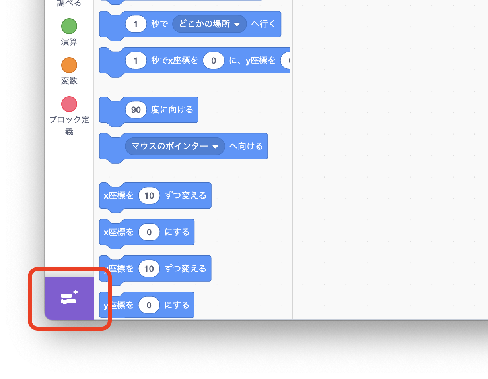
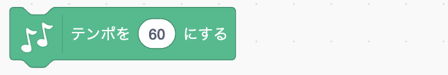

# <ruby>秋鹿学<rt>あいかまな</rt></ruby>びラボ プログラミング<ruby>教室<rt>きょうしつ</rt></ruby>

## <ruby>楽曲<rt>がっきょく</rt></ruby>を<ruby>奏<rt>かな</rt></ruby>でてみよう

<ruby>拡張機能<rt>かくちょうきのう</rt></ruby>の「<ruby>音楽<rt>おんがく</rt></ruby>」を<ruby>使<rt>つか</rt></ruby>ってコンピュータに<ruby>楽曲<rt>がっきょく</rt></ruby>を<ruby>演奏<rt>えんそう</rt></ruby>させてみましょう。

<ruby>拡張機能<rt>かくちょうきのう</rt></ruby>を<ruby>追加<rt>ついか</rt></ruby>するとコードのブロックが<ruby>選<rt>えら</rt></ruby>べるようになります。

## ブロックの<ruby>説明<rt>せつめい</rt></ruby>

テンポを<ruby>設定<rt>せってい</rt></ruby>します。<ruby>四分音符<rt>しぶおんぷ</rt></ruby>を 1<ruby>分間<rt>ぷんかん</rt></ruby>に<ruby>何回鳴<rt>なんかいな</rt></ruby>らすかを<ruby>数値<rt>すうち</rt></ruby>で<ruby>設定<rt>せってい</rt></ruby>します。

<ruby>楽譜<rt>がくふ</rt></ruby>に  と<ruby>書<rt>か</rt></ruby>かれていたら「88」を<ruby>入<rt>い</rt></ruby>れます。

<ruby>鳴<rt>な</rt></ruby>らす<ruby>楽器<rt>がっき</rt></ruby>の<ruby>音<rt>おと</rt></ruby>を<ruby>変更<rt>へんこう</rt></ruby>します。「(1) ピアノ」の<ruby>部分<rt>ぶぶん</rt></ruby>をクリックするといろいろな<ruby>楽器<rt>がっき</rt></ruby>から<ruby>選<rt>えら</rt></ruby>べます。

<ruby>楽器<rt>がっき</rt></ruby>の<ruby>音<rt>おと</rt></ruby>を<ruby>鳴<rt>な</rt></ruby>らします。「60 の<ruby>音符<rt>おんぷ</rt></ruby>を」のところで<ruby>音階<rt>おんかい</rt></ruby>（ドレミ）を<ruby>指定<rt>してい</rt></ruby>して、「0.25<ruby>拍鳴<rt>はくな</rt></ruby>らす」のところで<ruby>音<rt>おと</rt></ruby>の<ruby>長<rt>なが</rt></ruby>さを<ruby>指定<rt>してい</rt></ruby>します。

<ruby>音<rt>おと</rt></ruby>を<ruby>鳴<rt>な</rt></ruby>らさずに<ruby>休<rt>やす</rt></ruby>みます。<ruby>数値<rt>すうち</rt></ruby>は<ruby>休<rt>やす</rt></ruby>む<ruby>長<rt>なが</rt></ruby>さです。

テンポを<ruby>指定<rt>してい</rt></ruby>した<ruby>数値分変更<rt>すうちぶんへんこう</rt></ruby>します。
<ruby>途中<rt>とちゅう</rt></ruby>で<ruby>演奏<rt>えんそう</rt></ruby>スピードを<ruby>変<rt>か</rt></ruby>えたいときに<ruby>使<rt>つか</rt></ruby>います。

ドラムを<ruby>鳴<rt>な</rt></ruby>らします。<ruby>鳴<rt>な</rt></ruby>らす<ruby>長<rt>なが</rt></ruby>さも<ruby>指定<rt>してい</rt></ruby>できます。

「(1)スネアドラム」の<ruby>部分<rt>ぶぶん</rt></ruby>をクリックするといろいろなドラムから<ruby>選<rt>えら</rt></ruby>べます。

## <ruby>音階<rt>おんかい</rt></ruby>

<ruby>smalruby<rt>スモウルビー</rt></ruby>では<ruby>音階<rt>おんかい</rt></ruby>を<ruby>数値<rt>すうち</rt></ruby>で<ruby>指定<rt>してい</rt></ruby>します。
<ruby>基準<rt>きじゅん</rt></ruby>の「ド」を「60」として、<ruby>数値<rt>すうち</rt></ruby>が 1<ruby>増<rt>ふ</rt></ruby>えると<ruby>半音上<rt>はんおんあ</rt></ruby>がり、1<ruby>減<rt>へ</rt></ruby>ると<ruby>半音下<rt>はんおんさ</rt></ruby>がります。

<table>
  <tr>
    <td>...</td>
    <td>59</td>
    <td>60</td>
    <td>61</td>
    <td>62</td>
    <td>63</td>
    <td>64</td>
    <td>65</td>
    <td>66</td>
    <td>67</td>
    <td>68</td>
    <td>69</td>
    <td>70</td>
    <td>71</td>
    <td>72</td>
    <td>...</td>
  </tr>
  <tr>
    <td style="white-space: nowrap;"></td>
    <td style="white-space: nowrap;">ㇱ</td>
    <td style="white-space: nowrap:">ド</td>
    <td style="white-space: nowrap:">レ♭</td>
    <td style="white-space: nowrap:">レ</td>
    <td style="white-space: nowrap:">ミ♭</td>
    <td style="white-space: nowrap:">ミ</td>
    <td style="white-space: nowrap:">ファ</td>
    <td style="white-space: nowrap:">ソ♭</td>
    <td style="white-space: nowrap:">ソ</td>
    <td style="white-space: nowrap:">ラ♭</td>
    <td style="white-space: nowrap:">ラ</td>
    <td style="white-space: nowrap:">ㇱ♭</td>
    <td style="white-space: nowrap:">ㇱ</td>
    <td style="white-space: nowrap:">ド</td>
    <td></td>
  </tr>
  <tr>
    <td style="white-space: nowrap;"></td>
    <td style="white-space: nowrap;"></td>
    <td style="white-space: nowrap:"></td>
    <td style="white-space: nowrap:">ド♯</td>
    <td style="white-space: nowrap:"></td>
    <td style="white-space: nowrap:">レ♯</td>
    <td style="white-space: nowrap:"></td>
    <td style="white-space: nowrap:"></td>
    <td style="white-space: nowrap:">ファ♯</td>
    <td style="white-space: nowrap:"></td>
    <td style="white-space: nowrap:">ソ♯</td>
    <td style="white-space: nowrap:"></td>
    <td style="white-space: nowrap:">ラ♯</td>
    <td style="white-space: nowrap:"></td>
    <td style="white-space: nowrap:"></td>
    <td></td>
  </tr>
</table>

<ruby>音<rt>おと</rt></ruby>は 12<ruby>種類<rt>しゅるい</rt></ruby>あるので、12 を<ruby>足<rt>た</rt></ruby>すと 1 オクターブ<ruby>上<rt>うえ</rt></ruby>の<ruby>音<rt>おと</rt></ruby>になります。

## <ruby>音<rt>おと</rt></ruby>の<ruby>長<rt>なが</rt></ruby>さ

<ruby>音<rt>おと</rt></ruby>の<ruby>長<rt>なが</rt></ruby>さは<ruby>四分音符<rt>しぶおんぷ</rt></ruby>を 1<ruby>拍<rt>ぱく</rt></ruby>として<ruby>数<rt>かぞ</rt></ruby>えます。

| <ruby>音符<rt>おんぷ</rt></ruby>                                                   | <ruby>名前<rt>なまえ</rt></ruby>                   | <ruby>長<rt>なが</rt></ruby>さ   |
| ---------------------------------------------------------------------------------- | -------------------------------------------------- | -------------------------------- |
|                                             | <ruby>全音符<rt>ぜんおんぷ</rt></ruby>             | 4<ruby>拍<rt>はく</rt></ruby>    |
|                                            | <ruby>付点二分音符<rt>ふてんにぶおんぷ</rt></ruby> | 3<ruby>拍<rt>はく</rt></ruby>    |
|                                             | <ruby>二分音符<rt>にぶおんぷ</rt></ruby>           | 2<ruby>拍<rt>はく</rt></ruby>    |
|                                            | <ruby>付点四分音符<rt>ふてんしぶおんぷ</rt></ruby> | 1.5<ruby>拍<rt>ぱく</rt></ruby>  |
|                                             | <ruby>四分音符<rt>しぶおんぷ</rt></ruby>           | 1<ruby>拍<rt>ぱく</rt></ruby>    |
|    | <ruby>八分音符<rt>はちぶおんぷ</rt></ruby>         | 0.5<ruby>拍<rt>はく</rt></ruby>  |
|  | <ruby>十六分音符<rt>じゅうろくぶおんぷ</rt></ruby> | 0.25<ruby>拍<rt>はく</rt></ruby> |
|                                            | <ruby>四分休符<rt>しぶきゅうふ</rt></ruby>         | 1<ruby>拍<rt>ぱく</rt></ruby>    |
|                                            | <ruby>八分休符<rt>はちぶきゅうふ</rt></ruby>       | 0.5<ruby>拍<rt>はく</rt></ruby>  |

> **チャレンジ**
>
> <ruby>楽譜<rt>がくふ</rt></ruby>を<ruby>見<rt>み</rt></ruby>ながら、<ruby>楽曲<rt>がっきょく</rt></ruby>を<ruby>演奏<rt>えんそう</rt></ruby>するプログラムを<ruby>作<rt>つく</rt></ruby>ってみよう！
