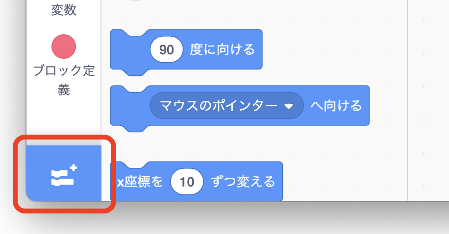
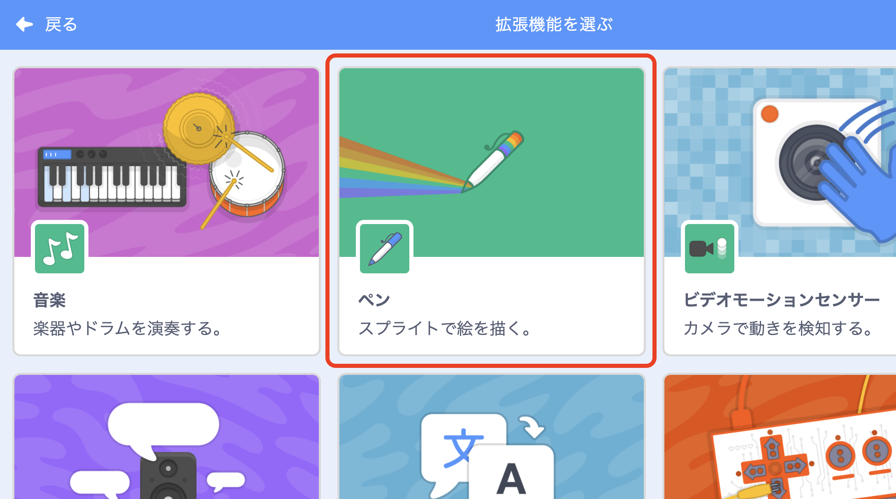
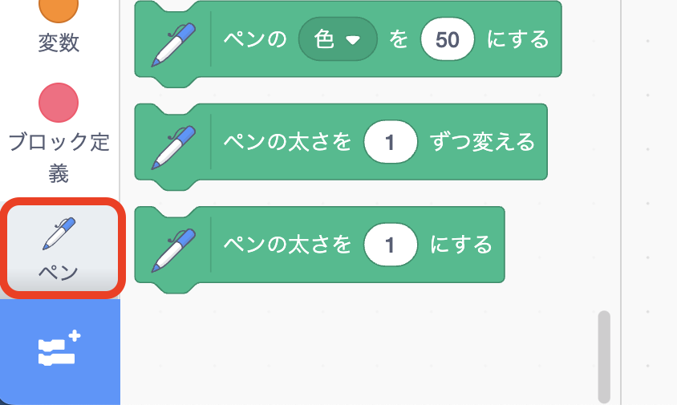
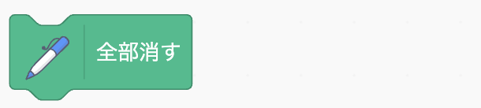
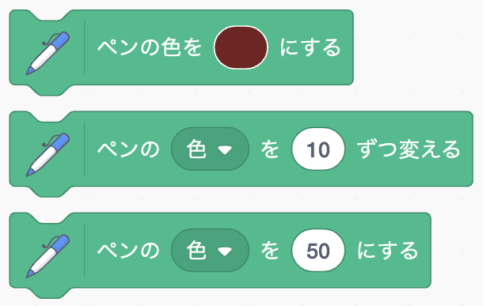
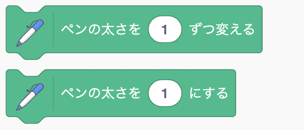
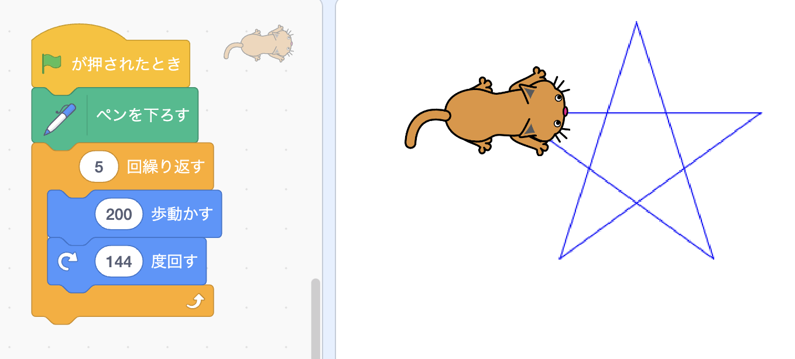

# <ruby>秋鹿学<rt>あいかまな</rt></ruby>びラボ プログラミング<ruby>教室<rt>きょうしつ</rt></ruby> ペンを<ruby>使<rt>つか</rt></ruby>ってみよう

<ruby>smalruby<rt>スモールビー</rt></ruby>では、ペンの<ruby>機能<rt>きのう</rt></ruby>を<ruby>追加<rt>ついか</rt></ruby>して<ruby>図形<rt>ずけい</rt></ruby>を<ruby>描<rt>か</rt></ruby>くことができます。

## <ruby>準備<rt>じゅんび</rt></ruby>

まずはペンを<ruby>追加<rt>ついか</rt></ruby>しましょう。

<ruby>smalruby<rt>スモールビー</rt></ruby>の<ruby>画面左下<rt>がめんりだりした</rt></ruby>にある<ruby>青<rt>あお</rt></ruby>いボタンをクリックします。

<ruby>拡張機能<rt>かくちょうきのう</rt></ruby>を<ruby>選<rt>えら</rt></ruby>ぶ<ruby>画面<rt>がめん</rt></ruby>でペンをクリックします。

コードのブロックにペンが<ruby>追加<rt>ついか</rt></ruby>されます。

## ペンのブロック

ペンで<ruby>描<rt>か</rt></ruby>いた<ruby>線<rt>せん</rt></ruby>を<ruby>全部消<rt>ぜんぶけ</rt></ruby>します。

スプライトのスタンプを<ruby>押<rt>お</rt></ruby>します。

ペンを<ruby>下<rt>お</rt></ruby>ろして<ruby>線<rt>せん</rt></ruby>を<ruby>描<rt>か</rt></ruby>く<ruby>準備<rt>じゅんび</rt></ruby>をします。 
この<ruby>状態<rt>じょうたい</rt></ruby>でスプライトを<ruby>移動<rt>いどう</rt></ruby>すると<ruby>線<rt>せん</rt></ruby>が<ruby>描<rt>か</rt></ruby>かれます。

ペンを<ruby>上<rt>あ</rt></ruby>げて<ruby>線<rt>せん</rt></ruby>を<ruby>描<rt>か</rt></ruby>くのをやめます。 
スプライトを<ruby>移動<rt>いどう</rt></ruby>しても<ruby>線<rt>せん</rt></ruby>が<ruby>描<rt>か</rt></ruby>かれなくなります。

ペンの<ruby>色<rt>いろ</rt></ruby>を<ruby>変<rt>か</rt></ruby>えます。 
いろいろな<ruby>変<rt>か</rt></ruby>え<ruby>方<rt>かた</rt></ruby>があるのでそれぞれ<ruby>試<rt>ため</rt></ruby>してみましょう。

ペンの<ruby>太<rt>ふと</rt></ruby>さを<ruby>変<rt>か</rt></ruby>えます。 

## <ruby>図形<rt>ずけい</rt></ruby>を<ruby>描<rt>か</rt></ruby>いてみよう

それではペンを<ruby>使<rt>つか</rt></ruby>っていろいろ<ruby>描<rt>か</rt></ruby>いてみよう！

たとえばこんなふうにプログラムすると<ruby>星<rt>ほし</rt></ruby>が<ruby>描<rt>か</rt></ruby>けるよ。

