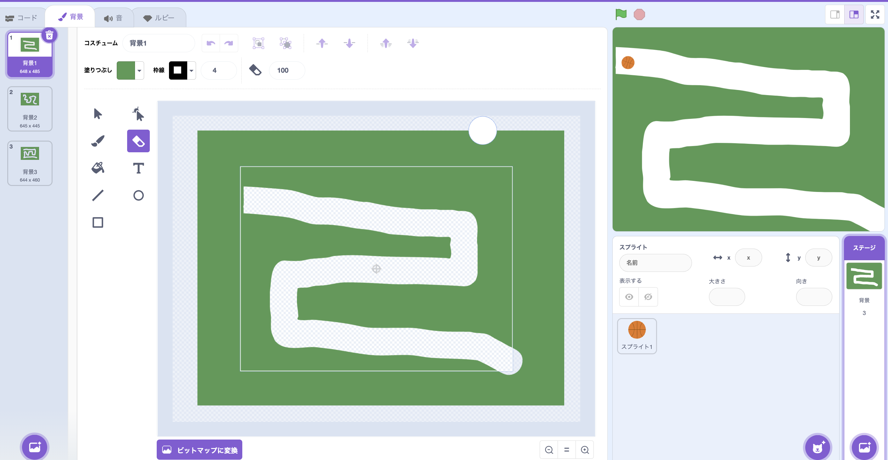

# <ruby>秋鹿学<rt>あいかまな</rt></ruby>びラボ プログラミング<ruby>教室<rt>きょうしつ</rt></ruby>
## スプライトを<ruby>道<rt>みち</rt></ruby>に<ruby>沿<rt>そ</rt></ruby>って<ruby>移動<rt>いどう</rt></ruby>させてよう

<ruby>今回<rt>こんかい</rt></ruby>はスプライトを<ruby>道<rt>みち</rt></ruby>に<ruby>沿<rt>そ</rt></ruby>って<ruby>移動<rt>いどう</rt></ruby>させてみましょう。

<ruby>背景<rt>はいけい</rt></ruby>に<ruby>自由<rt>じゆう</rt></ruby>に<ruby>道<rt>みち</rt></ruby>を<ruby>描<rt>か</rt></ruby>いて、その<ruby>道<rt>みち</rt></ruby>の<ruby>上<rt>うえ</rt></ruby>をスプライトが<ruby>移動<rt>いどう</rt></ruby>するプログラムを<ruby>作<rt>つく</rt></ruby>ってください。

> ヒント
>
> - いちばん<ruby>簡単<rt>かんたん</rt></ruby>なやり<ruby>方<rt>かた</rt></ruby>は、<ruby>X<rt>エックス</rt></ruby>と<ruby>Y<rt>ワイ</rt></ruby>の<ruby>位置<rt>いち</rt></ruby>を<ruby>調<rt></rt></ruby>べてそこまで<ruby>移動<rt>いどう</rt></ruby>する<ruby>方法<rt>ほうほう</rt></ruby>です
>   -  などのブロックを<ruby>使<rt>つか</rt></ruby>ってみましょう
>   - ただし、このやり<ruby>方<rt>かた</rt></ruby>では<ruby>道<rt>みち</rt></ruby>の<ruby>形<rt>かたち</rt></ruby>が<ruby>変<rt>か</rt></ruby>わったらうまく<ruby>移動<rt>いどう</rt></ruby>できません
> -  などを<ruby>使<rt>つか</rt></ruby>って、<ruby>色<rt>いろ</rt></ruby>に<ruby>触<rt>さわ</rt></ruby>ったら<ruby>動<rt>うご</rt></ruby>きを<ruby>変<rt>か</rt></ruby>えて<ruby>移動<rt>いどう</rt></ruby>するやり<ruby>方<rt>かた</rt></ruby>もあります
>   - スプライトは<ruby>縦<rt>たて</rt></ruby>と<ruby>横<rt>よこ</rt></ruby>の<ruby>長<rt>なが</rt></ruby>さが<ruby>同<rt>おな</rt></ruby>じものを<ruby>使<rt>つか</rt></ruby>ったほうがやりやすいです
