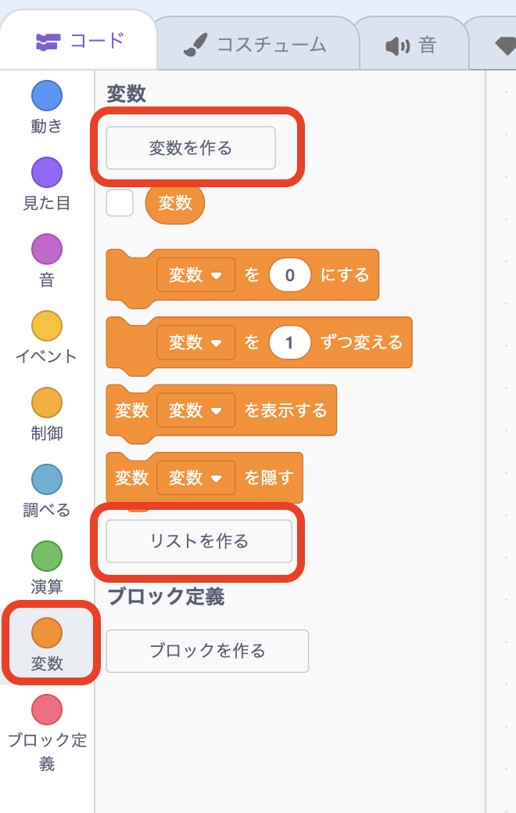

# <ruby>秋鹿学<rt>あいかまな</rt></ruby>びラボ プログラミング<ruby>教室<rt>きょうしつ</rt></ruby>

## タイピングゲームを<ruby>作<rt>つく</rt></ruby>ってみよう

- <ruby>画面<rt>がめん</rt></ruby>の<ruby>上<rt>うえ</rt></ruby>から<ruby>言葉<rt>ことば</rt></ruby>が<ruby>落<rt>お</rt></ruby>ちてくる
- <ruby>言葉<rt>ことば</rt></ruby>の<ruby>左端<rt>ひだりはし</rt></ruby>の<ruby>文字<rt>もじ</rt></ruby>と<ruby>同<rt>おな</rt></ruby>じキーを<ruby>押<rt>お</rt></ruby>すと<ruby>文字<rt>もじ</rt></ruby>が<ruby>消<rt>き</rt></ruby>える
- <ruby>文字<rt>もじ</rt></ruby>をすべて<ruby>消<rt>け</rt></ruby>すと<ruby>次<rt>つぎ</rt></ruby>の<ruby>言葉<rt>ことば</rt></ruby>が<ruby>落<rt>お</rt></ruby>ちてくる
- <ruby>文字<rt>もじ</rt></ruby>が<ruby>下<rt>した</rt></ruby>の<ruby>赤<rt>あか</rt></ruby>い<ruby>線<rt>せん</rt></ruby>に<ruby>触<rt>ふ</rt></ruby>れるとゲームオーバー

## <ruby>変数<rt>へんすう</rt></ruby>とリストの<ruby>準備<rt>じゅんび</rt></ruby>

はじめにプログラムで<ruby>使<rt>つか</rt></ruby>う<ruby>変数<rt>へんすう</rt></ruby>とリストを<ruby>準備<rt>じゅんび</rt></ruby>しましょう。

  <ruby>以下<rt>いか</rt></ruby>の<ruby>変数<rt>へんすう</rt></ruby>を<ruby>作<rt>つく</rt></ruby>ってください。
  <ul>
    <li><ruby>消<rt>け</rt></ruby>した<ruby>文字数<rt>もじすう</rt></ruby></li>
    <li><ruby>今<rt>いま</rt></ruby>の<ruby>問題<rt>もんだい</rt></ruby>で<ruby>消<rt>け</rt></ruby>した<ruby>文字数<rt>もじすう</rt></ruby></li>
    <li><ruby>文字<rt>もじ</rt></ruby>の<ruby>位置<rt>いち</rt></ruby></li>
    <li><ruby>問題<rt>もんだい</rt></ruby></li>
    <li><ruby>問題<rt>もんだい</rt></ruby>の<ruby>文字数<rt>もじすう</rt></ruby></li>
  </ul>
<ruby>以下<rt>いか</rt></ruby>のリストを<ruby>作<rt>つく</rt></ruby>ってください。
  <ul>
    <li><ruby>問題集<rt>もんだいしゅう</rt></ruby></li>
  </ul>

<ruby>問題集<rt>もんだいしゅう</rt></ruby>の<ruby>中<rt>なか</rt></ruby>には<ruby>問題<rt>もんだい</rt></ruby>となる<ruby>言葉<rt>ことば</rt></ruby>をいくつか<ruby>入<rt>い</rt></ruby>れておきます。

## スプライトの<ruby>準備<rt>じゅんび</rt></ruby>

<ruby>今回<rt>こんかい</rt></ruby>のプログラムで<ruby>使<rt>つか</rt></ruby>うスプライトは「<ruby>文字<rt>もじ</rt></ruby>」と「<ruby>赤線<rt>あかせん</rt></ruby>」の 2 つだけです。

アルファベットは 26 <ruby>文字<rt>もじ</rt></ruby>ありますが、26 <ruby>個別々<rt>こべつべつ</rt></ruby>にスプライトを<ruby>作<rt>つく</rt></ruby>ってそれぞれにプログラムを<ruby>書<rt>か</rt></ruby>くのは<ruby>大変<rt>たいへん</rt></ruby>なので、1 つの「<ruby>文字<rt>もじ</rt></ruby>」というスプライトをクローンしてコスチュームを<ruby>切<rt>き</rt></ruby>り<ruby>替<rt>か</rt></ruby>えて<ruby>使<rt>つか</rt></ruby>います。

<ruby>文字<rt>もじ</rt></ruby>のスプライトに a〜z のアルファベット 26 <ruby>文字<rt>もじ</rt></ruby>をすべて<ruby>追加<rt>ついか</rt></ruby>して、それぞれ<ruby>文字<rt>もじ</rt></ruby>と<ruby>同<rt>おな</rt></ruby>じ<ruby>名前<rt>なまえ</rt></ruby>をつけておきます。

## プログラミング

<ruby>準備<rt>じゅんび</rt></ruby>ができたのであとはどんなプログラミングをすれば<ruby>良<rt>よ</rt></ruby>いか<ruby>考<rt>かんが</rt></ruby>えてみてください。

プログラミングするときは、<ruby>関数<rt>かんすう</rt></ruby>ブロックの<ruby>定義<rt>ていぎ</rt></ruby>を<ruby>使<rt>つか</rt></ruby>ってどんな<ruby>処理<rt>しょり</rt></ruby>が<ruby>必要<rt>ひつよう</rt></ruby>か<ruby>整理<rt>せいり</rt></ruby>すると<ruby>考<rt>かんが</rt></ruby>えやすいです。

### <ruby>文字<rt>もじ</rt></ruby>のプログラム

### <ruby>赤線<rt>あかせん</rt></ruby>のプログラム

